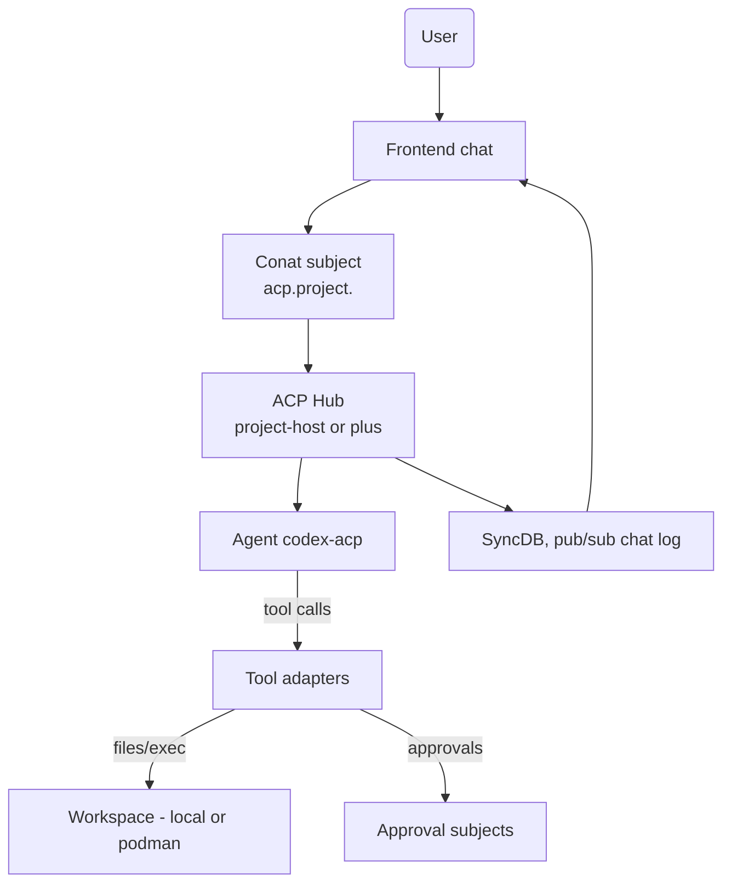
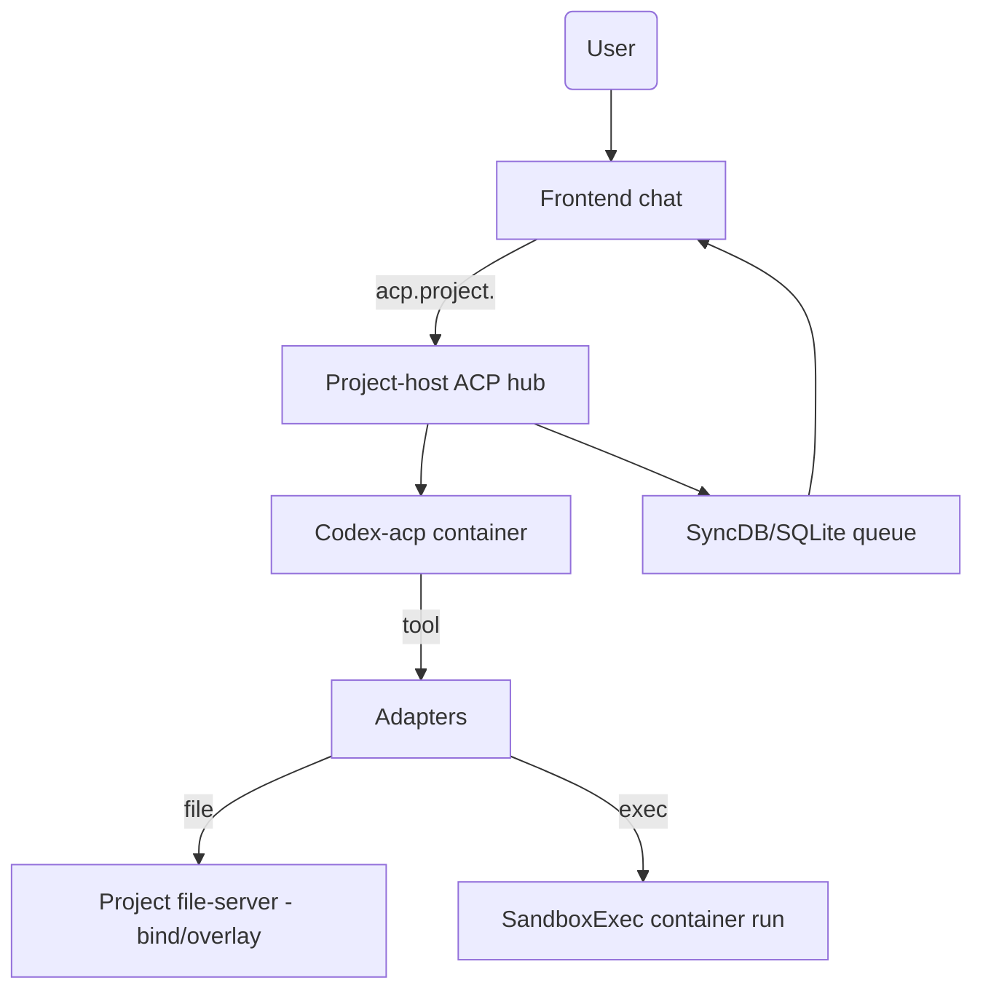

# Agent Architecture in CoCalc

This document explains how AI agents (Codex/ACP-based) are wired into CoCalc in both single-user (cocalc-plus) and multiuser (project-host/podman) modes. It highlights communication flow, where containers are used, and how ACP is leveraged.

## What ACP Is

Agent Client Protocol (ACP) is a JSON-RPC style protocol that lets an agent request tools such as terminal exec, file read/write, apply patches, and approvals. We embed our forked `codex-acp` as the agent runtime; CoCalc provides the tool adapters that enforce workspace scoping and auditing.

## High-Level Flow

user → frontend → ACP hub → agent process → tool adapters → workspace.

## Modes

### cocalc-plus (local)

ACP hub and tools run inside the same process as the user. Exec runs on the host; files go through the hub’s adapters so every change is logged and diffed. Workspace roots are resolved against the user’s HOME.

### Multiuser / podman (project-host)

ACP hub runs in project-host. Agents run inside a dedicated codex-acp container. Tool calls are proxied into the target project:

- **Files**: go through `setContainerFileIO` (project-host/file-server) so only project-bound paths are accessible.
- **Exec**: uses `sandboxExec` to spin up a lightweight podman container with the project rootfs mounted; runs even when the main project container is stopped, potentially with extra levels of sandboxing.

## Containers for Agents

The agent acts as a sandboxed control plane with no direct access to project files or system configuration.

- `codex-acp` runs in its own rootless podman container (image built via `src/packages/ai/acp/containers/codex.ts`).
- Persistent state (sessions, auth tokens) is bind-mounted into the container.
- Tool calls never touch host paths directly; all workspace access goes through adapters.

## Communication Details

- **Transport:** Conat subjects (`acp.project.<project_id>.api` for requests; pub/sub for events).
- **Approvals:** Per-account subjects; project-host forwards to codex-acp.
- **Persistence:** Events are queued in SQLite/AKV and replayed after restarts; chat SyncDB stores the user-visible log.
- **Concurrency:** API listeners process messages in parallel with a p-limit cap to avoid head-of-line blocking.

## Security Notes

- Workspace scoping is enforced in adapters (file IO via file-server; exec via sandboxExec). No direct filesystem access from the agent container.
- Environment secrets: pass through controlled env/secret files; avoid exposing provider keys in process listings.
- Optional dials (roadmap): read-only mounts, subset writable mounts, and network toggles for sandboxExec.

## Quick References

- ACP hub (lite/project-host): [src/packages/lite/hub/acp/index.ts](../packages/lite/hub/acp/index.ts)
- Agent container builder: [src/packages/ai/acp/containers/codex.ts](../packages/ai/acp/containers/codex.ts)
- Podman sandbox exec: [src/packages/project-runner/run/sandbox-exec.ts](../packages/project-runner/run/sandbox-exec.ts)
- Conat ACP bridge: [src/packages/conat/ai/acp](../packages/conat/ai/acp)

