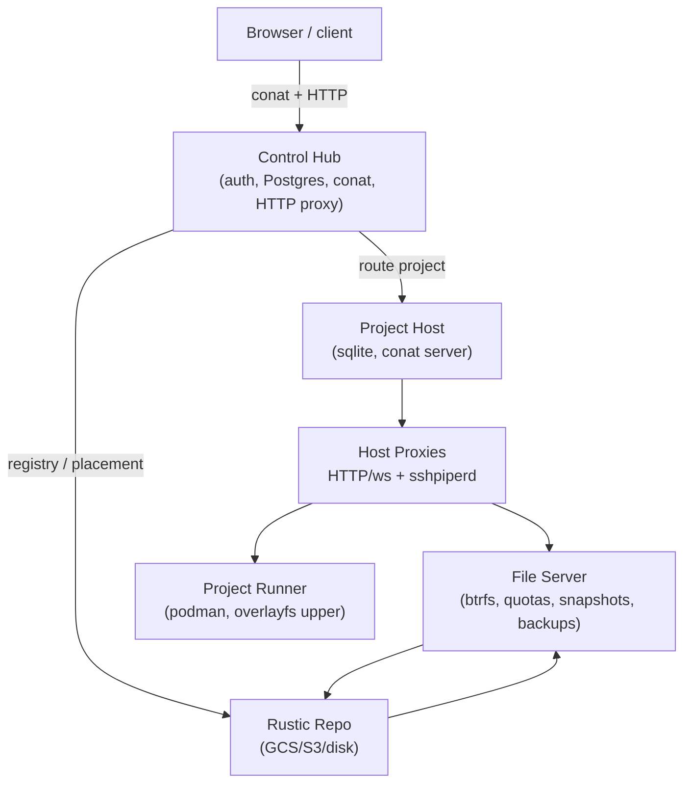
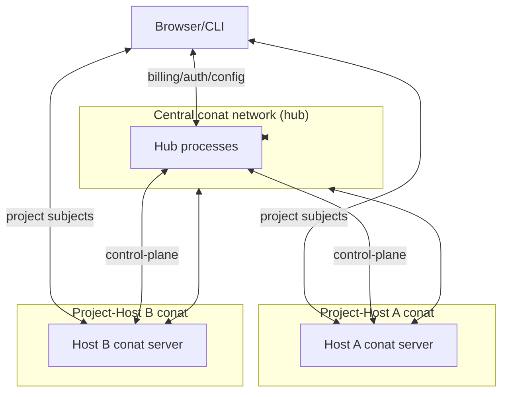

# CoCalc Architecture (Current Draft)

> Updated to reflect the new project-host model (Dec 2025). This is a working draft; keep it in sync with the code.

At a glance: The control hub handles auth/config and keeps project placement in Postgres, then routes both conat and HTTP/WS traffic directly to the project\-host that owns a project. Each project\-host combines file\-server, project\-runner, HTTP/WS proxy, conat with persistence, sshpiperd and a local btrfs volume with per\-project subvolumes, quotas, snapshots, and backups \(rustic\). Projects run in podman with overlayfs uppers stored inside the project, so user changes are captured in snapshots/backups and survive moves. Moves stream btrfs sends over sshpiperd to another host; backups push snapshots to a rustic repo. Host keys and placement are distributed over conat so routing stays correct after moves/restarts.

---

## Goals & Non-Goals

**Goals**

- Fast, durable per-project storage with clear quotas.
- Projects are self-contained on a project-host: file server + runner + proxies together.
- First-class snapshots and backups; predictable moves between hosts.
- Low-latency UX by routing directly to the host that owns the project.

**Non-Goals**

- Centralized file server as single bottleneck (replaced by many project-hosts).
- Per-user UID isolation inside projects (containers + quotas instead).
- Perfect cross-host dedup; backups/moves are host-scoped and routed.

---

## High-Level Components

1) **Control Hub (master)**

- Auth/billing/config and the source of project placement metadata (Postgres).
- Runs conat for control-plane RPC (project-host registry, project start/stop/move, backups).
- Proxies HTTP to project-hosts for project-facing URLs; routes conat subjects to the right host.
- Maintains `projects` rows (host_id, host info, rootfs_image, quotas, move_status) and `project_hosts` registry.
- Internally the “hub” is a pool of Node.js hub/server processes plus the shared Postgres database; hub processes are elastic/ephemeral, Postgres is the durable source of truth.

2) **Project Hosts**

- Combined file-server + project-runner + proxies on a btrfs volume.
- SQLite state per host: projects table (ports, users, image, quotas, auth keys), host keys, backup jobs.
- Services:
  - File server (btrfs operations, quotas, snapshots, backups).
  - Project runner (podman) with overlayfs rootfs per image.
  - HTTP proxy (to project containers) and SSH ingress via sshpiperd.
  - Conat server for project services (fs, terminal, etc.).
- Backups: rustic repo per host (configurable; GCS on cocalc.com).

3) **Projects (containers)**

- Podman container per project with overlayfs upperdir in `.local/share/overlay/` keyed by image.
- Ports: internal HTTP proxy on 80; SSH on per-project port.
- Rootfs image: `rootfs_image` (or legacy `compute_image`) normalized on host, cached locally.
- Persist store: per-project data/kv streams under `sync/projects/<project_id>` on the host.

4) **Proxies**

- HTTP: master proxies `/PROJECT/port/
/...` to the owning host; project-host proxies to container:80 with `prependPath:false`.
- SSH: sshpiperd on each host terminates SSH and forwards to the project sshd (user-level) or host-level btrfs/host-ssh endpoints with forced commands.

---

## Diagram (request/compute/data)

---

## Conat topology (multiple networks)

- Central **control conat network** runs in the hub tier for control\-plane subjects \(project\-host registry, start/stop/move/backup RPCs\).
- Each **project\-host runs its own conat server** for project data\-plane subjects \(fs, terminal, editor sync, etc.\) scoped to its projects.  This includes its own persistence layer for TimeTravel edit history.
- Participants hold multiple connections:
  - **Hub**: connected to the central network to talk to all hosts; may open host data\-plane connections when proxying certain operations.
  - **Project\-host**: connected to the central network \(register, receive control RPCs\) and runs its own conat server for project traffic.
  - **Clients \(browser/CLI\)**: primarily connect to the host’s conat server for project traffic; the hub can proxy WebSocket/conat if direct access is not possible.
- Conat client routing \(routeSubject\) dispatches `project-<id>` subjects to the correct host conat connection; other subjects stay on the central network.

---

## Storage & Quotas (per project-host)

- Each project lives in a btrfs subvolume `project-<project_id>` on the host mount.
- Quotas via qgroups on the live subvolume; snapshots live under `.snapshots` and are accounted in the same quota policy (live + snapshots).
- Scratch/overlay: `.local/share/overlay/` upperdirs are inside the project and included in quotas/snapshots/backups.
- Persist store is separate (`sync/projects/<project_id>`) and included in backups and moves.
- Optional compression/dedup (e.g., zstd, bees) per host.

---

## Snapshots

- RO snapshots under `project-.../.snapshots`. Automatic + user-named; host enforces retention and quota locally.
- Sent/preserved during moves; browsed/restored in UI; not stored in backups (backups are file-level).

## Backups

- Taken from a RO snapshot + persist dir; stored in a rustic repo per host (GCS on cocalc.com, configurable elsewhere).
- Restores can target any host; archived projects may exist only as backups.
- Scheduling: daily per active project (host-side) plus user-triggered; one at a time per project.

## Moves (host ↔ host)

- Orchestrated by the control hub (Postgres-backed state machine `project_moves`, mirrored into `projects.move_status`).
- Data paths:
  - Pipe (default): `btrfs send | sshpiperd | forced-command btrfs receive` into `/btrfs/_incoming`, then re-home snapshots and clone the latest snapshot to become the live subvolume.
  - Staged (optional): write send streams to disk, rsync to dest, then receive.
- SSH auth: source connects to dest sshpiperd as `btrfs-<source_host_id>`; dest sshd runs forced `btrfs receive` and only trusts the dest’s sshpiperd key; host-to-host public keys distributed by the hub.
- Post-move: host_id/host updated in Postgres; snapshots preserved; persist store copied; quotas re-assigned on dest.

---

## Data Flows (common)

**Start project**

- Hub loads project meta (`rootfs_image/compute_image`, run_quota, users, host_id/host).
- If no placement, hub picks an active host and asks it to create/start the project.
- Host normalizes image, writes sqlite row, ensures ports/quotas/authorized_keys, starts podman container, exposes conat/fs/ssh/http.

**User access**

- Browser connects via master; conat subjects routed to the owning host; HTTP/WS proxied via master → host → container.
- SSH goes through host sshpiperd to project sshd; authorized keys merged from master + project files + managed key.

**Backup**

- Host snapshots project, runs rustic on snapshot + persist dir, records job state; hub API lists/starts/restores.

**Move**

- Hub enqueues move; maintenance worker drives the state machine; source streams to dest; dest re-homes and registers; hub updates `projects` and publishes status.

---

## Policies & Safety

- Hard quotas via qgroups; ENOSPC scoped to the project subvolume.
- Overlay upperdirs are part of the project footprint (snapshots/backups include them).
- Forced-command SSH for btrfs receive; single exposed sshpiperd port per host; known-hosts pinning possible.
- Restart-safe orchestration: hub state in Postgres; workers use `FOR UPDATE SKIP LOCKED`; progress/status surfaced to UI.

---

## Open Items (ongoing)

- Image allowlist/error reporting in UI; local rootfs support for very large images.
- Tunable snapshot/backup retention; pruning policies per host/project.
- Stronger story for untrusted hosts (per-bucket backups, limited key distribution).
- Observability: richer progress metrics for moves/backups; host health surfacing.

