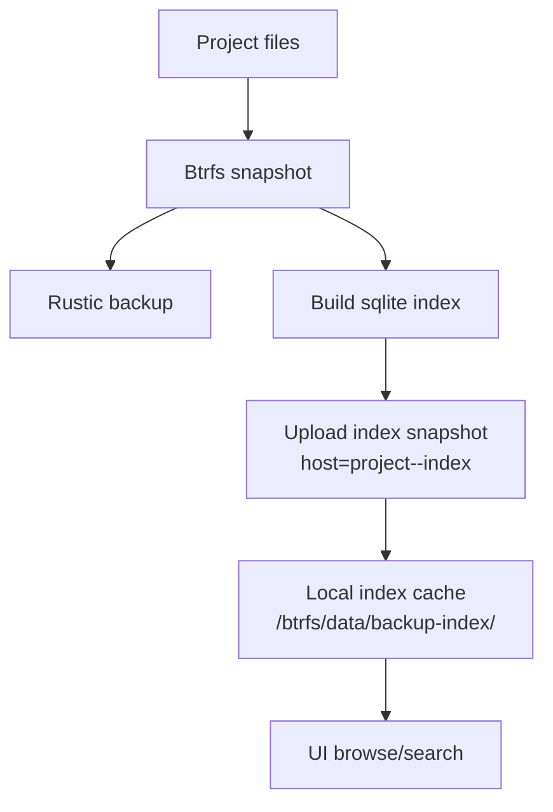

# Backup Indexes

CoCalc stores project backups in rustic repositories. Rustic is fast and
reliable for backup/restore, but its query surface is intentionally small.
For interactive browsing and search, we need fast local queries without
pulling metadata from remote buckets or forking rustic.

## Motivation

- Avoid forking rustic: its CLI output and query features are not rich
  enough for our UI, and it is intentionally optimized for backup/restore.
- Avoid bucket latency: listing and search should be local and fast even
  when backups live in remote cloud storage.

## Strategy

1. When a backup is created, we also build a compact sqlite index from the
   same btrfs snapshot. This index stores file metadata (parent, name, type,
   size, mtime, mode).
2. The sqlite index is uploaded as a separate rustic snapshot under a
   dedicated host identity: `project-<project_id>-index`.
3. On each project host, we keep a local index cache at
   `/btrfs/data/backup-index/<project_id>`.
4. UI listing and search read only from the local sqlite cache.
5. When backups are deleted, their index snapshots are pruned and local
   cache entries removed.
If an index build fails, that backup is still valid for full restore, but it
won't appear in the interactive backup browser until a successful index is
generated.

## Diagram

## Notes

- The index is authoritative only for UI browsing and search. Backup restore
  always uses rustic snapshots.
- The sqlite schema is compact and designed for fast parent/name lookup.
- Index snapshots are kept in the same rustic repo, so the approach works
  for local disks or any supported remote backend.

