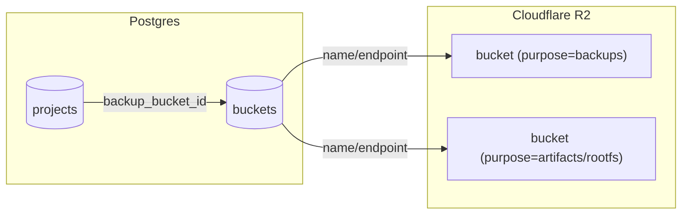

# Buckets Architecture

This document defines how CoCalc uses object storage buckets (Cloudflare R2) for
backups and artifacts. It is designed to be safe, auditable, and flexible for
future providers.

## Goals

- Backups are **per\-project, encrypted** and can be destroyed independently.
- Bucket placement is **region\-aware** but **stable** once assigned.
- Bucket selection is **explicit** and recorded in the database.
- Artifacts \(software, rootfs\) are **separate** from backups.
- Future migrations are possible but **never implicit**.

## Key Principles

- **Per\-project repo**: each project has its own rustic repo in its bucket.
- **Bucket registry**: buckets are tracked in a `buckets` table with a purpose field.
- **First\-use creation**: buckets are created automatically only when a region is used.
- **No silent switches**: once a project is bound to a bucket, it stays unless
  a deliberate migration is performed.

## Architecture Diagram

## Data Model

`buckets` table (generic registry):

- `id` (primary key)
- `purpose` (`backups`, `artifacts`, `rootfs`, `logs`, ...)
- `provider` (`r2`, later others)
- `account_id` (provider account)
- `region` (wnam/enam/weur/eeur/apac/oc)
- `location` (reported by provider, if available)
- `name`, `endpoint`
- `status` (active, mismatch, unknown, disabled)
- timestamps

`projects.backup_bucket_id`:

- Set once on first backup.
- Never changed unless an explicit migration is run.

## Backup Flow (per-project)

1. On first backup, select a bucket for the project:
   - Prefer region-matched bucket.
   - Create bucket if missing (using location hint).
   - Verify actual location and record in `buckets`.
2. Assign `projects.backup_bucket_id`.
3. Rustic uses:
   - `bucket` = bucket name
   - `root` = `rustic/project-<project_id>`
   - `password` = per-project secret

## Artifact Flow (software, rootfs)

- Artifacts use **separate buckets** with `purpose=artifacts` or `rootfs`.
- These are shared and cacheable; no per-project secrets.
- Region selection is independent of backups.

## Location & Stickiness

Cloudflare R2 location hints are **best-effort** and **sticky by bucket name**.
If a bucket name is reused, the original location will be reused. For that
reason:

- Use new bucket names if the first placement is wrong.
- Record actual location in `buckets.location`.
- Do not silently switch a bucket for an existing region.

## Deletion & Compliance

Per-project repos + per-project passwords allow for strong deletion semantics.
Destroying a project’s backups can be done by:

- Deleting the repo objects, and/or
- Destroying the project backup password

Master-key rotation can further limit exposure from old DB backups.

## Migration (Future)

Migration requires an explicit admin action:

- Copy/restore repo to a new bucket
- Verify restore works
- Update `projects.backup_bucket_id`
- Optionally deprecate old bucket

This is intentionally not automatic.
