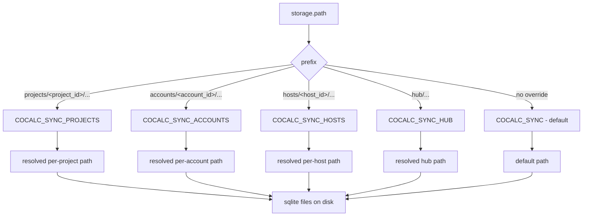

## Conat filesystem RPCs (sandbox)

- Frontends talk to the sandboxed filesystem over Conat using the `@cocalc/conat/files/fs` client. Each method is a request/response RPC to the backend `SandboxedFilesystem`.
- Paths are always sandbox-relative; the backend enforces safety via `safeAbsPath`.
- Common calls: `readFile`, `writeFile`, `writeFileDelta` (patch+etag helper), `watch` (proxied chokidar), and `syncFsWatch(path, active?)` to heartbeat or drop interest in a shared backend watcher.
- Watch streams use a Conat socket subject `watch-${service}`; the first `watch()` call stands up a server-side watch; subsequent calls reuse it.
- Errors propagate with codes (e.g., `ENOENT`, `ETAG_MISMATCH`, `PATCH_FAILED`) so callers can retry or fall back to full writes.

## Conat persistence storage layout

Persisted SQLite streams/kv live under a filesystem root that is resolved from
the Conat storage path (e.g., `projects/<project_id>/...`).

- **Default root**: `COCALC_SYNC` → `syncFiles.local` \(falls back to `${DATA}/sync`\).
- **Per\-subject overrides** \(optional\):
  - `COCALC_SYNC_PROJECTS` for `projects/<project_id>/...`
  - `COCALC_SYNC_ACCOUNTS` for `accounts/<account_id>/...`
  - `COCALC_SYNC_HOSTS` for `hosts/<host_id>/...`
  - `COCALC_SYNC_HUB` for `hub/...`
- Placeholders \- what we use in project hosts:
  - `COCALC_SYNC_PROJECTS=/btrfs/project-[project_id]/.local/share/cocalc/persist`
  - `COCALC_SYNC_ACCOUNTS=/data/accounts/[account_id]/persist`
  - `COCALC_SYNC_HOSTS=/data/hosts/[host_id]/persist`
- Archive/backup \(if configured; not used in project hosts\) mirror the same `storage.path` under
  `COCALC_SYNC_ARCHIVE` / `COCALC_SYNC_BACKUP`.

## Bootlog streams (projects + hosts)

- Bootlogs are short-lived DStreams for lifecycle progress. Names:
  - Project: `bootlog.project.<project_id>`
  - Host: `bootlog.host.<host_id>`
- API (`@cocalc/conat/project/runner/bootlog`):
  - `bootlog({ project_id?, host_id?, ...event })` to publish.
  - `get({ project_id?, host_id? })` to subscribe to the stream; messages expire via TTL (default 1h).
- Frontend client: `webapp_client.conat_client.projectBootlog({ project_id?, host_id? })` wraps `get`.

### Auth for bootlogs

- Socket.io auth checks subjects:
  - Project access: collaborators can pub/sub on `project.<id>.>` and `*.project-<id>.>`.
  - Host access: owners or collaborators (from `project_hosts.metadata.owner` / `metadata.collaborators`) can sub/pub on `bootlog.host.<host_id>.>`.
  - Inbox/public rules still apply (`_INBOX.*`, `public.*`).
- See `server/conat/socketio/auth.ts`:
  - `extractProjectSubject` parses project subjects.
  - `extractHostSubject` parses `bootlog.host.<uuid>.>` subjects.
  - `isHostOwnerOrCollaborator` queries `project_hosts` metadata to authorize.

### Usage patterns

- Project start/stop/move: publish events with `project_id`.
- Host start/stop: publish events with `host_id` for live feedback.
- UI: use bootlog for detailed lifecycle (start/stop) while keeping list views updated via polling or changefeeds.

