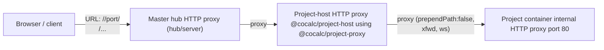

# CoCalc HTTP Proxying (Project Hosts)

This note summarizes how HTTP traffic is routed now that projects live on project-hosts. See the referenced source files for the current implementation details.

## High-level flow

- Browser (or API client) issues a URL like `/PROJECT_ID/port/6002/...` against the master hub.
- Master hub proxies that request to the project-host that owns the project (host lookup is part of project placement).
- Project-host proxies the request into the project container’s internal HTTP proxy (running inside the Podman container on port 80).
- Responses flow back along the same chain; WebSocket upgrades follow the identical path.

## Diagram

## Master hub behavior

- The hub inspects incoming project URLs, resolves the project’s host from Postgres, and proxies directly to that host.
- Path is preserved (no extra prefixes). WebSocket upgrades are forwarded.
- Key code: hub proxy middleware in [src/packages/server](./src/packages/server).

## Project-host behavior

- Project-host attaches the shared proxy handler from `@cocalc/project-proxy`.
- URL parser extracts `project_id` and optional `port/<n>` selector.
- It resolves the project’s ephemeral proxy port from the project-host SQLite state and targets `127.0.0.1:<http_port>` with `prependPath: false`.
- WebSocket upgrades are enabled; `xfwd` is on for accurate client IPs.
- Key code: [src/packages/project-host/main.ts](./src/packages/project-host/main.ts) and [src/packages/project-proxy/proxy.ts](./src/packages/project-proxy/proxy.ts).

## Project container behavior

- Inside each project container, `cocalc-project` runs an internal HTTP proxy \(port 80\) that fronts services like JupyterLab, VS Code, etc., using the `/project_id/port/<n>/...` pattern.
- The container listens on `0.0.0.0` so the host\-level proxy can reach it.
- Key code: [src/packages/project/servers/proxy/proxy.ts](./src/packages/project/servers/proxy/proxy.ts).

## Notable implementation points

- Proxy library: `http-proxy-3` \(maintained API\-compatible fork of unmaintained http\-proxy\) with `prependPath: false`, `ws: true`, `xfwd: true`.
- Routing correctness depends on stable project→host placement and the project\-host SQLite port registry.
- If a request arrives before placement exists, the hub will not have a host; callers should surface a clear error.
- For security, host\-level proxies only forward to loopback targets derived from registered project state; unrecognized paths fall through to a 404 handler.

