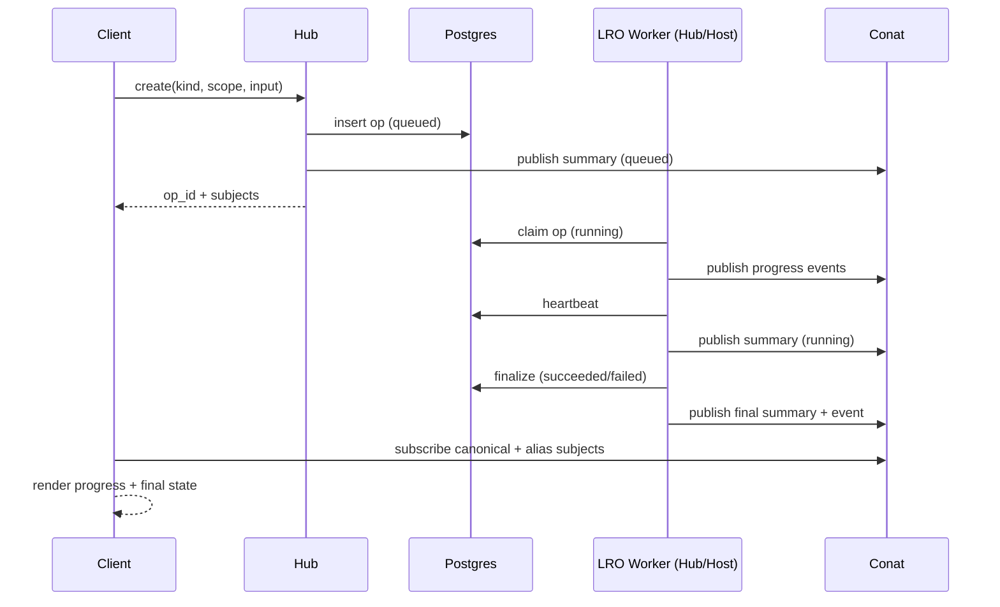

# Long-running operations (LRO)

This document defines a long-running operations (LRO) system for CoCalc. The goal is to make operations like backups, restores, project start, and cross-host file copies fully async, with high-quality progress updates and robust recovery.

## Goals

- Async-first: creation never blocks on actual work.
- Durable state: a task survives restarts and can be retried.
- Low DB load: use DB for summaries only, conat for high-resolution progress.
- Works across hub, host, and browser with locality when possible.
- Supports arbitrarily long tasks, retries, and best-effort cancellation.

## Non-goals

- Real-time hard cancellation guarantees (best-effort only).
- Strong ordering across unrelated operations (each op is independent).

## High-level design

- A request creates an operation record and returns an op_id immediately.
- Workers claim queued ops, heartbeat, emit progress events, and finalize.
- Progress events are published to a conat persistent stream (dstream).
- A summary is stored in Postgres and mirrored to conat for quick reads.
- Clients subscribe to a canonical subject and (optionally) a project-scoped alias for locality.

## Data model (authoritative summary)

Postgres table: `long_running_operations` (summary only, not full logs).

Fields:

- op_id
- kind
- scope_type, scope_id
- status (queued, running, succeeded, failed, canceled, expired)
- created_by (account_id or system)
- owner_type, owner_id (hub or host)
- routing (hub | host_id | none)
- input (small JSON)
- result (small JSON or reference)
- error (string)
- progress_summary (small JSON)
- attempt, heartbeat_at
- created_at, started_at, finished_at, updated_at
- expires_at (summary retention)
- dedupe_key (optional)
- parent_id (optional)

Indexes:

- (scope_type, scope_id, status)
- (owner_type, owner_id, status)
- (dedupe_key, scope_type, scope_id)
- updated_at

## Conat persistence

Use conat dstream for progress events. This gives persistence, changefeed, and TTL.

Progress stream configuration:

- max_msgs and max_age to cap retention
- allow_msg_ttl for event TTL
- storage backend may be :memory: or disk (configurable)

Summary stream:

- small summary JSON can be published to the same stream as a distinct event type, or to a separate summary stream.
- do not use dkv; dstream already provides persistence and replay.

## Subject naming and locality

We want a canonical subject that works with existing auth and an alias for locality.

Canonical subject (auth-friendly, no changes required):

- lro.project-<project_id>.<op_id>
- lro.account-<account_id>.<op_id>
- lro.host-<host_id>.<op_id>
- lro.hub.<op_id>

This matches existing auth rules in [src/packages/server/conat/socketio/auth.ts](./src/packages/server/conat/socketio/auth.ts) because it uses the second segment format (project-<id>, account-<id>, host-<id>).

Alias subject for locality (project-scoped):

- project.<project_id>.lro.<op_id>

Use this alias whenever the op has a project scope. This keeps client traffic local to the project host when possible (e.g., Australia client and Australia host), while the canonical stream remains available for global access.

## API surface

Hub APIs:

- create({ kind, scope, input, routing, dedupe_key, ttl }) -> { op_id, status, subject, alias_subject? }
- get({ op_id }) -> summary
- list({ scope_type, scope_id, kind?, status? }) -> summaries
- wait({ op_id, timeout }) -> final summary or timeout
- cancel({ op_id }) -> summary

Host-side helpers:

- publishProgress({ op_id, event })
- updateStatus({ op_id, status, result?, error? })
- heartbeat({ op_id })

## State machine

- queued -> running -> succeeded | failed | canceled | expired
- stale heartbeat:
  - running -> queued (retry) OR
  - running -> failed (max_attempts reached)

## Dedupe behavior

Default behavior: return existing active op if dedupe_key matches within scope.

- key: (scope_type, scope_id, dedupe_key)
- if active exists: return it
- if finished: create a new op

## Cancellation

Best-effort only. Workers check for canceled status at safe checkpoints and stop when possible.

## Retention

Configurable defaults:

- Postgres summary retention: 1 week
- conat progress retention: short (hours to days), configured via max_msgs/max_age/ttl

## Worker lease and heartbeats

- Claim queued ops with SELECT ... FOR UPDATE SKIP LOCKED.
- Set running + heartbeat_at on claim.
- Heartbeat periodically (e.g., every 30s).
- Stale heartbeat -> retry or fail.

## Progress event format

Event example:

- { ts, phase, message, progress?, detail?, level? }

Progress can be:

- percent (0-100)
- or { current, total, unit, weight } for bootlog-style progress bars

Keep a ring buffer of recent events for late subscribers.

## Bootlog alignment

Treat bootlog as a special case of LRO. Its progress and UI should work with the same event format and stream semantics.

See [src/packages/conat/project/runner/bootlog.ts](./src/packages/conat/project/runner/bootlog.ts) for the current bootlog pattern.

## Mermaid diagram

## Implementation plan

1. **Types and helpers**
   - Add shared LRO types and a progress helper module.
   - Align event format with bootlog to reuse UI components.

2. **Persistence wiring**
   - Add Postgres table and indices for summaries.
   - Add conat dstream setup helpers (configurable max_age/max_msgs/ttl).

3. **Subject and auth**
   - Introduce subject helpers for canonical and alias subjects.
   - Use the `lro.<scopeTag>.<op_id>` pattern to avoid auth changes.
   - Optionally add explicit auth rules for `lro.*` if we ever want `lro.project.<id>`.

4. **Hub API**
   - Implement create/get/list/wait/cancel endpoints.
   - Provide dedupe support and return canonical + alias subjects.

5. **Worker runtime**
   - Add a worker lease/heartbeat loop for queued ops.
   - Provide host-side helper functions to emit progress and finalize.

6. **First integration**
   - Migrate one operation (copy or backup) to LRO.
   - Validate progress UI and wait semantics.

7. **Broader adoption**
   - Move project start, restore, and copy into LRO.
   - Standardize user-facing progress messages.

## Open configuration knobs

- DB summary TTL
- Conat stream max_age / max_msgs / per-message ttl
- Heartbeat interval and stale threshold
- Retry limits per op kind
