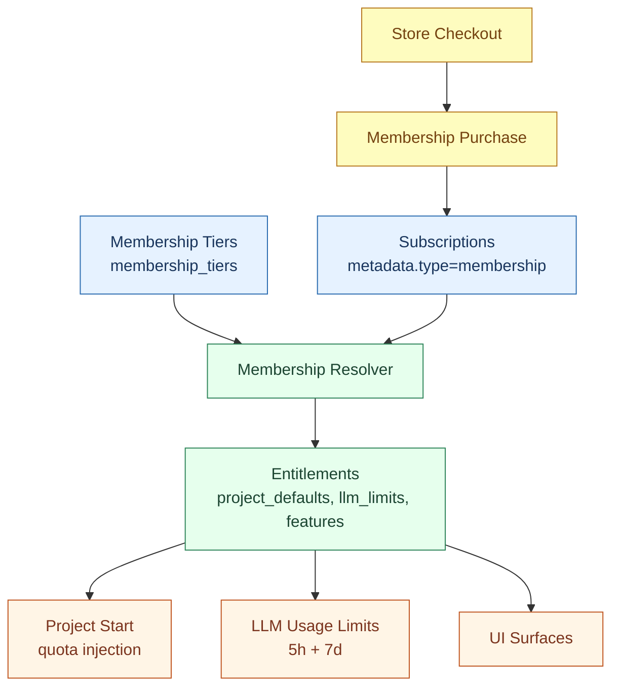

# Membership Implementation (CoCalc)

This document explains how membership is implemented in the current codebase. It is intended for developers and agents who need an overview and pointers to the relevant files.

## Overview

Membership replaces the legacy project license model for new work. A user’s effective membership class is resolved from subscriptions (and other sources in the future), then used to determine:

- Default project quotas when a project starts.
- LLM usage limits (5-hour and 7-day windows).
- Feature flags and other entitlements.

Purchases and subscriptions are still handled by the existing billing system, but membership metadata drives behavior instead of license metadata.



## Data Model

### membership_tiers

Membership tiers live in a dedicated table with per-tier pricing and entitlements:

- Table schema: [src/packages/util/db-schema/membership-tiers.ts](./src/packages/util/db-schema/membership-tiers.ts)
- DB handler (history on update): [src/packages/database/postgres/membership-tiers.ts](./src/packages/database/postgres/membership-tiers.ts)
- Admin UI: [src/packages/frontend/admin/membership-tiers.tsx](./src/packages/frontend/admin/membership-tiers.tsx)

Each tier has:

- `id`, `label`, `priority`
- pricing (`price_monthly`, `price_yearly`)
- entitlements (`project_defaults`, `llm_limits`, `features`)

### subscriptions (membership metadata)

Membership subscriptions are stored in the existing subscriptions table, with metadata:

```
{ type: "membership", class: "<tier-id>" }
```

Schema: [src/packages/util/db-schema/subscriptions.ts](./src/packages/util/db-schema/subscriptions.ts)

## Resolver

The resolver computes a single effective membership class and entitlements:

- Resolver: [src/packages/server/membership/resolve.ts](./src/packages/server/membership/resolve.ts)
- Tier lookup/pricing: [src/packages/server/membership/tiers.ts](./src/packages/server/membership/tiers.ts)

Resolution currently uses active membership subscriptions; priority logic is supported via tier `priority`.

## Project Quotas

When a project starts, membership defaults are merged into project settings:

- Quota injection point: [src/packages/server/projects/control/base.ts](./src/packages/server/projects/control/base.ts)
- Membership defaults helper: [src/packages/server/membership/project-defaults.ts](./src/packages/server/membership/project-defaults.ts)

This means the run quota depends on the effective membership entitlements at start time.

## LLM Usage Limits

LLM usage is no longer pay-as-you-go. Usage is tracked in “units” (cents) and checked against membership limits.

- Units helper: [src/packages/server/llm/usage-units.ts](./src/packages/server/llm/usage-units.ts)
- Abuse/limit checks: [src/packages/server/llm/abuse.ts](./src/packages/server/llm/abuse.ts)
- Usage status API: [src/packages/server/llm/usage-status.ts](./src/packages/server/llm/usage-status.ts)

Limits are defined via `llm_limits` in the membership tier, with keys:

- `units_5h` (5-hour window)
- `units_7d` (7-day window)

If no limits are set, the system treats the limit as 0.

## Store + Purchases

Memberships are purchased via the shopping cart flow:

- Cart item handler: [src/packages/server/purchases/purchase-shopping-cart-item.ts](./src/packages/server/purchases/purchase-shopping-cart-item.ts)
- Pricing and proration: [src/packages/server/membership/tiers.ts](./src/packages/server/membership/tiers.ts)

Upgrades (e.g., member → pro) cancel the existing subscription and apply prorated credit in the first charge.

## API Surface

Next.js API endpoints:

- Membership status: [src/packages/next/pages/api/v2/purchases/get-membership.ts](./src/packages/next/pages/api/v2/purchases/get-membership.ts)
- Tier list: [src/packages/next/pages/api/v2/purchases/get-membership-tiers.ts](./src/packages/next/pages/api/v2/purchases/get-membership-tiers.ts)
- LLM usage status: [src/packages/next/pages/api/v2/purchases/get-llm-usage.ts](./src/packages/next/pages/api/v2/purchases/get-llm-usage.ts)

Conat API (typed RPC):

- Types + endpoints: [src/packages/conat/hub/api/purchases.ts](./src/packages/conat/hub/api/purchases.ts)
- Server implementation: [src/packages/server/conat/api/purchases.ts](./src/packages/server/conat/api/purchases.ts)

## UI

Key UI surfaces:

- Store membership page: [src/packages/next/components/store/memberships.tsx](./src/packages/next/components/store/memberships.tsx)
- Subscriptions UI: [src/packages/frontend/purchases/subscriptions.tsx](./src/packages/frontend/purchases/subscriptions.tsx)
- LLM usage indicator: [src/packages/frontend/misc/llm-cost-estimation.tsx](./src/packages/frontend/misc/llm-cost-estimation.tsx)
- Balance modal usage display: [src/packages/frontend/purchases/balance-modal.tsx](./src/packages/frontend/purchases/balance-modal.tsx)
- Chat usage indicator (compact): [src/packages/frontend/chat/chatroom.tsx](./src/packages/frontend/chat/chatroom.tsx)

## Tests

- Resolver tests: [src/packages/server/membership/resolve.test.ts](./src/packages/server/membership/resolve.test.ts)
- Shopping cart membership tests (purchase + upgrade): [src/packages/server/purchases/purchase-shopping-cart-item.test.ts](./src/packages/server/purchases/purchase-shopping-cart-item.test.ts)

## Known Gaps / Planned Work

- Structured admin editors for `project_defaults`, `llm_limits`, and `features` (current UI uses raw JSON).
- Membership benefits copy in store + settings.
- Team/org seats and course grants to fully replace licenses.
