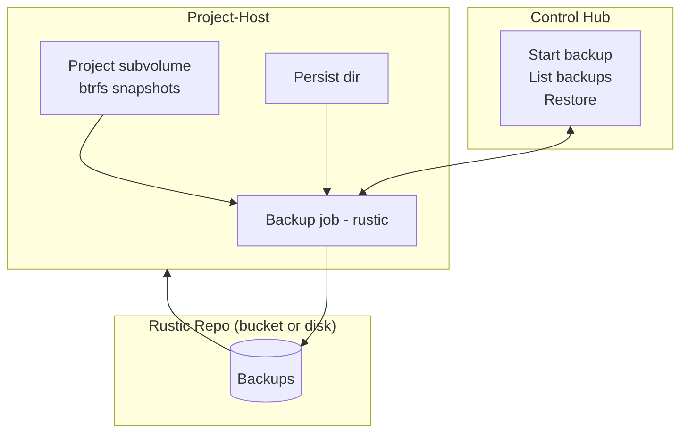

Project Backups
================

CoCalc backs up projects asynchronously from the project-host that holds the live btrfs subvolume. Backups are taken from a read-only snapshot (files + per-project persist store) and pushed to a rustic repository (GCS on cocalc.com; user-configurable elsewhere). Restores can target any project-host; archived projects may exist only as backups until restored.

Mermaid Overview
----------------

Scope
-----

- Data included: project btrfs snapshot \(files\) plus the per\-project persist store \(`data/sync/projects/<project_id>`\).
- Data excluded: btrfs snapshots themselves; backups are file\-level.
- Frequency: daily per active/recent project \(host\-side scheduler\) plus on\-demand user triggers.
- Concurrency: one backup at a time per project; small per\-host cap to protect I/O and CPU.

Behavior
--------

- Backup flow: take a read\-only btrfs snapshot, run rustic against it \(and the persist dir\), then drop the temporary snapshot. Job state is recorded on the host \(pending/running/succeeded/failed with timestamps\).
  - On hosts without btrfs, just backup the live filesystem.
- Restore flow: any host can restore using repo \+ backup id, reconstructing the project tree and persist dir; archived projects can be rehydrated this way.
- Failure/restart: running jobs on host restart become failed/stale and will retry on the next schedule or user request. No long RPC timeouts; initial “start” RPC ACKs quickly.

Storage / Repos
---------------

- [cocalc.com](http://cocalc.com): GCS with Autoclass; replicated buckets optional. Backups must be globally readable by trusted hosts for cross\-host restore.
- Untrusted hosts: use per\-host \(or per\-tenant\) buckets/credentials, or signed\-URL gateway uploads so untrusted hosts lack broad bucket access.
  - Untrusted hosts can also de\-archive projects backed up to a trusted bucket, but the project must first be extracted on trusted project\-host, then moved to the untrusted host.
- On\-prem: repo location is configurable \(local/NAS/S3\-compatible\).

Observability
-------------

- Host records job rows (project_id, backup_id, state, started/finished, bytes if available, repo). Hub API exposes list/status; UI shows last backup time/status and available backups. Progress streaming is optional; heartbeats can mark stalled jobs as failed.

Open Items
----------

- Integrate per-project persist store into move/backup paths everywhere.
- Decide repo sharing model for untrusted hosts (per-bucket vs. brokered uploads).
- Add pruning policy for old backups per project/host.

