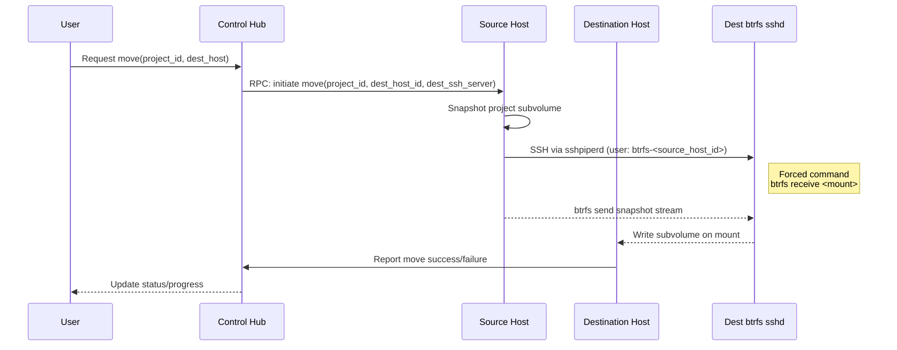
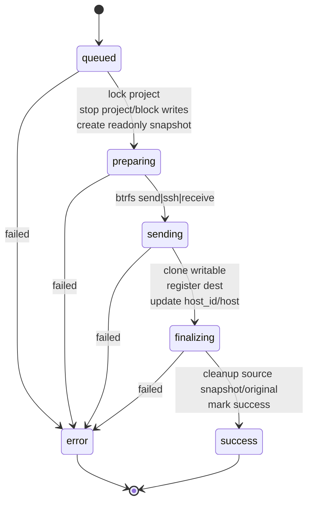

# Project move pipeline (host → host)

This document describes how a project is moved between project-hosts: the control hub chooses a destination, the source streams the project’s btrfs subvolume to the destination over a single sshpiperd-exposed port, and host-level security is enforced with forced-command `btrfs receive` plus host-specific keys. Progress is reported back to the master so the UI stays in sync, and the initial cut favors a simple stop-and-send flow before adding incremental or snapshot-preserving moves.

- **Orchestration \(hub, restart\-safe\)**
  - Hubs are ephemeral \(autoscaling, maintenance, rolling upgrades\), so orchestration can’t rely on in\-memory state or long\-lived hub processes. Everything must be durable in Postgres and idempotent so any hub can resume work after a restart.
  - Moves are tracked in Postgres \(e.g., `project_moves`\), keyed by project\_id \(and a job\_id\). Fields include source\_host\_id, dest\_host\_id, status \(queued/preparing/sending/finalizing/success/error\), snapshot\_name, bytes\_sent, last\_update, error, started\_at, finished\_at.
  - A hub/worker runs a state machine \(see diagram below\) that is idempotent; each step advances status and is re\-runnable after a hub restart.
  - Concurrency control via advisory locks or a partial unique index prevents multiple simultaneous moves for a project.
  - Visibility: changefeeds on the projects table \(or a `moving`/`move_status` JSON column\) surface status to the UI; a REST/Conat endpoint can return move status for non\-changefeed clients.
  - Stuck detection can be a later sweep that marks long\-idle jobs as error.

- **Control flow**
  - Master (control hub) selects a destination host for a project and issues a move RPC to the source host (see [packages/project-host/hub/move.ts](./packages/project-host/hub/move.ts)).
  - Source host uses `btrfs send` to stream the project subvolume; destination host uses `btrfs receive` to import it.
  - Progress/status is reported back to the master so the UI can reflect the current state.

- **SSH plumbing (single exposed port via sshpiperd)**
  - All external SSH goes through sshpiperd (see [packages/project-proxy/ssh-server.ts](./packages/project-proxy/ssh-server.ts)).
  - For moves, the source host connects to the destination using username `btrfs-<dest_host_id>` via sshpiperd on the destination. No direct sockets are exposed.
  - sshpiperd, after authenticating the caller, dials a dedicated host-level `sshd` running on the destination (started in [packages/project-host/ssh/btrfs-sshd.ts](./packages/project-host/ssh/btrfs-sshd.ts)) and forwards the stream.

- **Keys and authorization**
  - Each host has a persisted sshpiperd keypair managed by the control hub (stored in [packages/project-host/sqlite/hosts.ts](./packages/project-host/sqlite/hosts.ts)).
  - The btrfs `sshd` on a host is configured with a forced command `btrfs receive <mount>` and only authorizes the local sshpiperd public key. This keeps the attack surface small (no shells, no port/X11/agent forwarding).
  - Host-to-host authentication for the upstream leg (source → destination sshpiperd) uses the **source** host’s published public key; only that key is accepted for the matching `btrfs-<source_host_id>` user.

- **Filesystem semantics**
  - Projects live as btrfs subvolumes under the host mount point (see [packages/project-host/file-server.ts](./packages/project-host/file-server.ts)).
  - Current implementation performs a stop-then-full-send/receive; incremental/hot-move is a future optimization.
  - Snapshots can be included by sending the readonly snapshot lineage before the final writable subvolume, but the initial version may keep it simple (stop early, send the main subvolume).

- **Why no container for btrfs receive**
  - `btrfs receive` needs direct mount access; running it on the host avoids extra privileges and namespace complexity.
  - Safety comes from the forced command and the fact that only sshpiperd can connect to this `sshd`.

Keep this doc in sync with the move implementation as we add progress reporting, snapshot preservation, and incremental sends.

