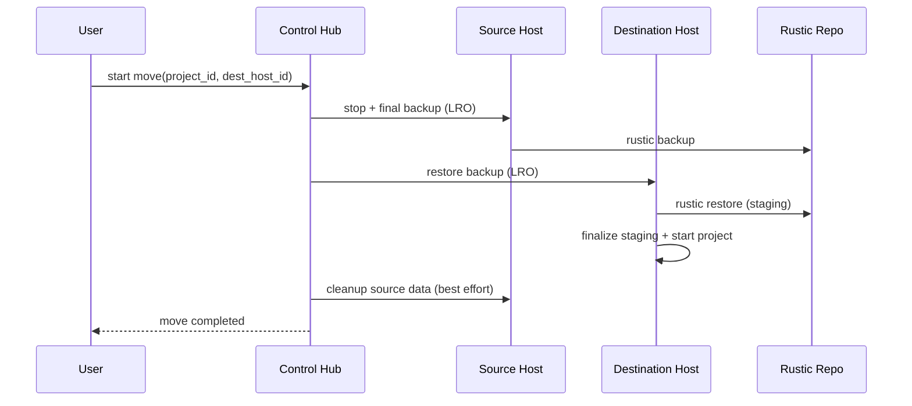

# Project Move (Current)

Moves are implemented as **backup -> restore -> start** using rustic repositories. There is no host-to-host transfer in the current move path.

## Summary

- The control hub orchestrates a move as an LRO (`project-move`).
- The source host always stops the project and takes a final backup.
- The destination host restores the backup via **restore staging** for atomicity.
- After the destination project starts successfully, the source data is cleaned up.
- If the source host is offline, cleanup is deferred until it next starts.

## High-level flow

## Restore staging (atomicity)

Restores run through the staging helper in [src/packages/file-server/btrfs/restore-staging.ts](./src/packages/file-server/btrfs/restore-staging.ts) so a crash or reboot during restore cannot leave a half-restored project. The final handoff is an atomic rename once staging completes.

## Failure behavior

- **Backup fails:** move fails; the source project remains unchanged.
- **Restore fails:** move fails; the destination is cleaned if possible.
- **Destination start fails:** move fails; cleanup is skipped to preserve data.
- **Source host offline:** move can still proceed if a usable backup exists; cleanup is deferred until the source host comes back online.

## Notes

- The move pipeline is LRO-driven; UI shows progress and errors from the LRO stream.
- Backups are always taken, even if `last_edited <= last_backup`, to ensure a consistent final snapshot.
