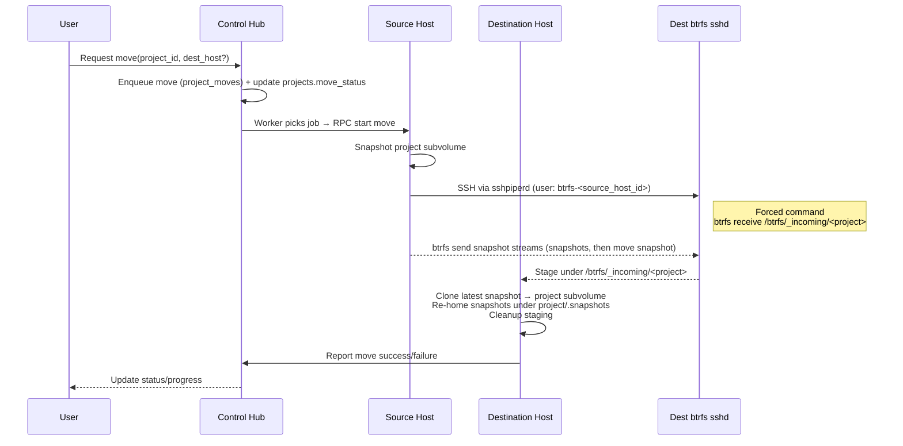
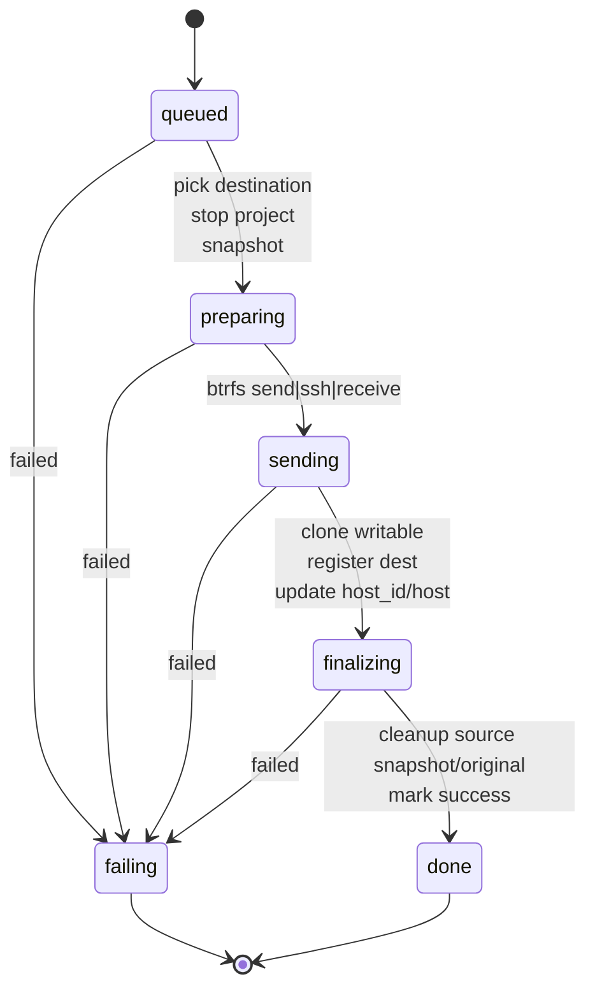

# Project move pipeline (host → host)

This document describes how a project is moved between project-hosts: the control hub chooses a destination, the source streams the project’s btrfs subvolume to the destination over a single sshpiperd-exposed port, and host-level security is enforced with forced-command `btrfs receive` plus host-specific keys. Progress is reported back to the master so the UI stays in sync. The current implementation preserves snapshots by staging them on the destination, cloning the latest snapshot to become the live project subvolume, and re-homing all snapshots under the project before cleaning up staging.

- **Orchestration \(hub, restart\-safe\)**
  - Hubs are ephemeral \(autoscaling, maintenance, rolling upgrades\), so orchestration can’t rely on in\-memory state or long\-lived hub processes. Everything is durable in Postgres and idempotent so any hub can resume after a restart.
  - Moves are tracked in Postgres table `project_moves` and mirrored into `projects.move_status` \(JSONB\). Fields include source\_host\_id, dest\_host\_id, state \(queued/preparing/sending/finalizing/done/failing\), snapshot\_name, progress/status\_reason, attempt, timestamps.
  - A single maintenance hub \(the `--mentions` instance\) runs a worker loop that advances the state machine \(see diagram below\). Steps are re\-runnable after a hub restart.
  - Concurrency control: primary key on project\_id; worker uses `FOR UPDATE SKIP LOCKED` to ensure only one move per project runs.
  - Visibility: UI reads `projects.move_status` via changefeeds; other clients can poll a move\-status endpoint later.
  - Stuck detection/backoff can be added later as a sweep.

- **Control flow**
  - Hub enqueues a move (chooses destination if not provided), updates `projects.move_status`, and returns immediately.
  - Maintenance worker pops queued moves, stops the project, snapshots, and orchestrates send/receive via host control RPCs (see [packages/server/project-host/move-worker.ts](./packages/server/project-host/move-worker.ts)).
  - Two data paths now exist:
    - **Pipe mode** (default): `btrfs send | ssh | btrfs receive` directly.
    - **Staged mode** (`PROJECT_MOVE_MODE=staged`): create stream files under `/btrfs/_streams/<project>/<move>`, `rsync` them to the destination, then `btrfs receive` from those files into `/btrfs/_incoming/<project>`, followed by the same re-homing/finalize step.
  - On success, dest is registered and started; status is written back to Postgres for the UI.

- **SSH plumbing (single exposed port via sshpiperd)**
  - All external SSH goes through sshpiperd (see [packages/project-proxy/ssh-server.ts](./packages/project-proxy/ssh-server.ts)).
  - For moves, the source host connects to the destination using username `btrfs-<source_host_id>` via sshpiperd on the destination. No direct sockets are exposed.
  - sshpiperd, after authenticating the caller, dials a dedicated host-level `sshd` running on the destination (started in [packages/project-host/ssh/btrfs-sshd.ts](./packages/project-host/ssh/btrfs-sshd.ts)) and forwards the stream.

- **Keys and authorization**
  - Each host has a persisted sshpiperd keypair managed by the control hub (stored in [packages/project-host/sqlite/hosts.ts](./packages/project-host/sqlite/hosts.ts)).
  - The btrfs `sshd` on a host is configured with a forced command `btrfs receive <mount>` and only authorizes the local sshpiperd public key. This keeps the attack surface small (no shells, no port/X11/agent forwarding).
  - Host-to-host authentication for the upstream leg (source → destination sshpiperd) uses the **source** host’s published public key; only that key is accepted for the matching `btrfs-<source_host_id>` user.

- **Filesystem semantics**
  - Projects live as btrfs subvolumes under the host mount point (see [packages/project-host/file-server.ts](./packages/project-host/file-server.ts)).
  - Current implementation performs a stop-then-full-send/receive; incremental/hot-move is a future optimization.
  - Snapshots can be included by sending the readonly snapshot lineage before the final writable subvolume, but the initial version may keep it simple (stop early, send the main subvolume).

- **Why no container for btrfs receive**
  - `btrfs receive` needs direct mount access; running it on the host avoids extra privileges and namespace complexity.
  - Safety comes from the forced command and the fact that only sshpiperd can connect to this `sshd`.

Keep this doc in sync with the move implementation as we add progress reporting, snapshot preservation, and incremental sends.
