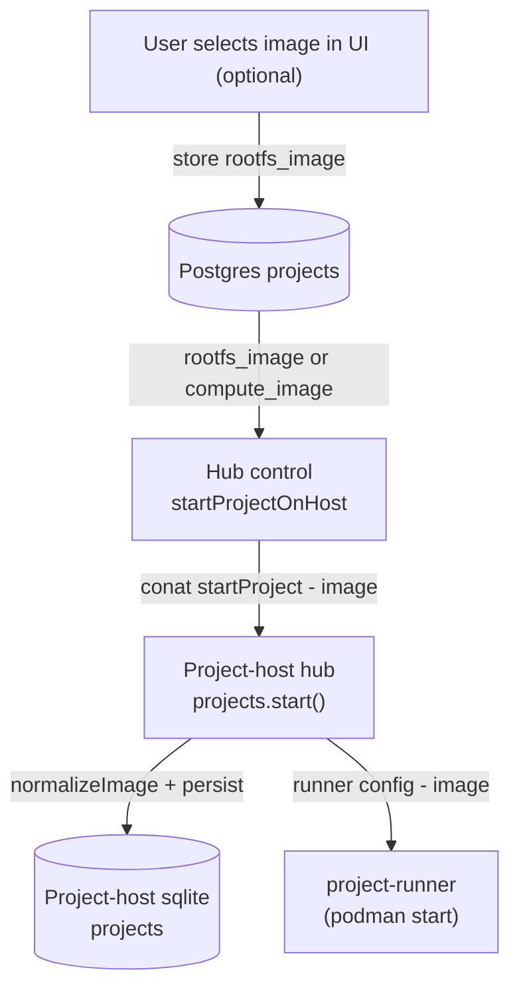

# Project RootFS Image Flow

This doc explains how a project’s root filesystem image is selected and flows through the project-host stack: where the image comes from (Postgres `rootfs_image`/`compute_image`), how it is normalized and persisted on the host, how project-runner launches with it, and how the local rootfs cache + overlayfs capture user changes, snapshots, backups, and moves. It also notes supported sources (Docker/OCI today, planned local rootfs) and compatibility behavior.

In practice: the hub loads `COALESCE(rootfs_image, compute_image)` from Postgres and sends it to the project-host via conat; the host normalizes it (Docker/OCI ref, fallback to the default rootfs), saves it in sqlite, and feeds it to project-runner. The host copies/pulls the image into a local cache and runs with overlayfs; the upperdir lives in `.local/share/overlay/` inside the project, keyed per image, so `apt-get` changes persist, get snapshot/backup coverage, and move with the project. Legacy `compute_image` rows still work, empty/unknown images fall back to the default, and future support will allow supplying a local rootfs directory when images are too large/private for registries.

## Data sources

- Postgres `projects` table stores `rootfs_image` (new) and legacy `compute_image`.
- Project-host sqlite stores the normalized `image` for each project.
- Defaults come from `DEFAULT_PROJECT_IMAGE` (and legacy `DEFAULT_COMPUTE_IMAGE`).

## End-to-end flow

## Key steps and files

- Load from Postgres: the hub uses `COALESCE(rootfs_image, compute_image) AS image` so older rows still work.  
  See [src/packages/server/project-host/control.ts](./src/packages/server/project-host/control.ts).
- Send to host: `startProjectOnHost` includes `image` in the conat request to the project-host.  
  See [src/packages/conat/project-host/api.ts](./src/packages/conat/project-host/api.ts) and handler wiring in [src/packages/project-host/master.ts](./src/packages/project-host/master.ts).
- Persist and normalize on host: `projects.start()` stores the image in sqlite and normalizes it (currently: trim; if empty or looks like a legacy label, fall back to `DEFAULT_PROJECT_IMAGE`).  
  See [src/packages/project-host/hub/projects.ts](./src/packages/project-host/hub/projects.ts).
- Runner launch: `getRunnerConfig` returns the normalized image to project-runner, which uses it when creating the podman container.

## Notes & compatibility

- Legacy `compute_image` continues to work via the `COALESCE` fallback; new UIs should write `rootfs_image`.
- Normalization is intentionally conservative today: if the value lacks a tag/registry and matches legacy labels (e.g. the old compute image), it falls back to the default rootfs image to avoid pulling huge legacy images.
- If image selection fails or is blank, the default rootfs image is used.

## RootFS sources and layout

- **Container image (today):** `image` is treated as a Docker/OCI reference; if no registry is present, Docker Hub is assumed. Images must include a reasonably recent glibc or the runtime will fail.
- **Custom local directory (planned):** we will allow using a local rootfs path for very large/private images not published to a registry.
- **Local rootfs store + overlayfs:** the pulled (or provided) rootfs is copied into a local cache on the project-host. Projects run with overlayfs; the upperdir lives inside the project at `.local/share/overlay/`, keyed per image. User changes (e.g., `apt-get install`) are written to that upperdir, persist across restarts, are captured in snapshots/backups, and follow the project when moved. Switching images selects a different overlay namespace so base image changes do not clobber other overlays.
