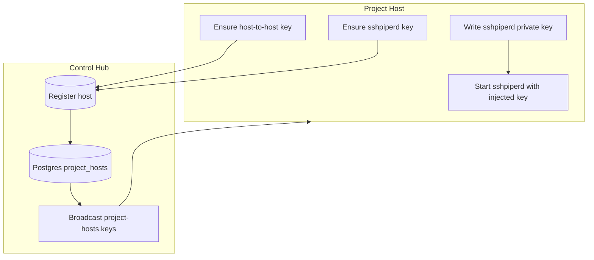

# SSH Key Generation and Distribution (Control Hub ↔ Project Hosts)

This describes how the control hub and project hosts mint, persist, and exchange SSH keys. See the code in [src/packages/project-host](./src/packages/project-host) and [src/packages/server](./src/packages/server) for details.

## Key types

- **Host-to-host key**: Used for inter-host SSH (rsync/reflect-sync, host containers). Stored per host in sqlite columns `host_to_host_public_key` / `host_to_host_private_key`.
- **sshpiperd key**: Host’s ingress key used by sshpiperd to terminate SSH connections. Stored per host in sqlite columns `sshpiperd_public_key` / `sshpiperd_private_key`.

## Where keys live

- Local persistence: [src/packages/project-host/sqlite/hosts.ts](./src/packages/project-host/sqlite/hosts.ts) table `project_hosts` holds all per-host key material.
- Secrets on disk: sshpiperd private key is written to `${SECRETS}/sshpiperd/host_key` before launching sshpiperd.

## Who generates what

- On project-host startup, `ensureHostKey` and `ensureSshpiperdKey` (see [src/packages/project-host/ssh](./src/packages/project-host/ssh)) generate keys if missing, update sqlite, and return the keypair.
- sshpiperd is launched from [src/packages/project-host/file-server.ts](./src/packages/project-host/file-server.ts) with `hostKeyPath` pointing at the injected private key, so it never self-generates.

## How keys are distributed

- Project-host registers with the control hub via conat (`project-hosts.api`) from [src/packages/project-host/master.ts](./src/packages/project-host/master.ts), sending:
  - `host_to_host_public_key`
  - `sshpiperd_public_key`
- Control hub stores these in Postgres (metadata) and rebroadcasts over conat `project-hosts.keys` (see [src/packages/server/conat/host-registry.ts](./src/packages/server/conat/host-registry.ts)).
- Project hosts subscribe to `project-hosts.keys` and cache peer public keys via [src/packages/project-host/ssh/host-keys.ts](./src/packages/project-host/ssh/host-keys.ts).

NOTE:  Right now all public keys are distributed to all clients, implementing a complete graph of trust.  However, we could implement untrusted project hosts by NOT redistributing their private keys.   

## How keys are used

- **Inbound SSH (users → projects/host container)**: sshpiperd presents the per-host sshpiperd key from `${SECRETS}/sshpiperd/host_key`. Authorization is decided by the sshpiperd auth plugin (see [src/packages/project-proxy/auth.ts](./src/packages/project-proxy/auth.ts)) using authorized keys gathered from the master and project filesystem.
- **Host-to-host SSH (rsync/reflect-sync)**: When a host connects to another host’s sshpiperd using username `project-host-{host_id}`, sshpiperd authorizes that single host’s public key (looked up from cached `host_to_host_public_key`). This avoids loading all host keys and scales to many hosts.
- **Known-hosts pinning**: Callers that initiate SSH to a host can pin to the advertised `sshpiperd_public_key` to prevent MITM. (See TODOs in [src/packages/project-host/hub/projects.ts](./src/packages/project-host/hub/projects.ts) for enabling strict checking by default.)

## Rotation and durability

- Keys persist in sqlite and are re-used across restarts.
- To rotate: delete/replace the stored key in sqlite (and the on-disk sshpiperd key for ingress), then restart the host; it will re-register and broadcast the new public keys.

## Control-plane flow (summary)

1) Host starts → ensures keys → writes sshpiperd private key to secrets → starts sshpiperd with that key.
2) Host registers with hub, sending both public keys.
3) Hub stores and rebroadcasts keys on `project-hosts.keys`.
4) Hosts subscribe and cache peer public keys for SSH authorization and known_hosts pinning.

