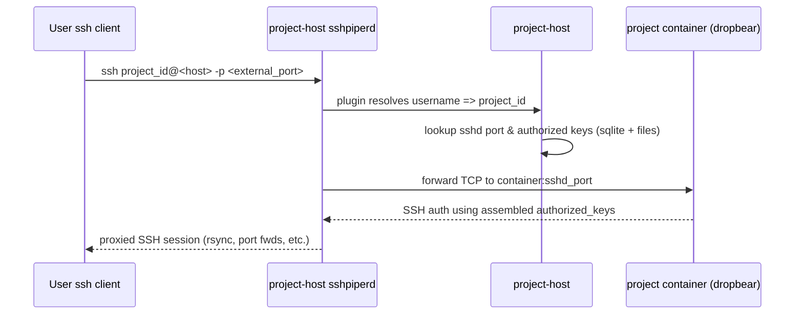

# CoCalc SSH Proxy

SSH access to projects uses sshpiperd and an assembled collection of authorized\_keys sources, including the PostgreSQL database _and_ the ~/.ssh/authorized\_keys file on disk.   By using sshpiperd, we get full support for port forwarding, X11 forwarding, etc., and also can route based on the username.

## Components

- Project container runs dropbear \(or OpenSSH\) inside the project's container.
  - Started by `start-project-ssh.sh`; listens on `$COCALC_SSHD_PORT` \(default 22\).
- Project host runs `sshpiperd` \(see [src/packages/project\-proxy/ssh\-server.ts](./src/packages/project-proxy/ssh-server.ts)\).
  - Terminates inbound SSH, chooses the target project, and forwards TCP/SSH to the project container.
- Metadata and helpers live in [src/packages/project\-host/file\-server.ts](./src/packages/project-host/file-server.ts) and [src/packages/project\-host/hub/projects.ts](./src/packages/project-host/hub/projects.ts).
  - Provide `getSshdPort`, `getAuthorizedKeys`, and key refresh hooks.

## Connection flow

## Authorized keys lifecycle

- Sources:
  - Account-level and project-level keys from master (stored in project-host sqlite `authorized_keys` column).
  - Project-local `~/.ssh/authorized_keys` inside the project.
  - Managed file under `~/.ssh/.cocalc/sshd/authorized_keys` written on start.
- Assembly:
  - `getAuthorizedKeys(project_id)` merges sqlite keys + managed keys + project-local file.
- Refresh:
  - Master calls `hub.projects.updateAuthorizedKeysOnHost` (see [src/packages/conat/hub/api/projects.ts](./src/packages/conat/hub/api/projects.ts) and [src/packages/server/conat/api/projects.ts](./src/packages/server/conat/api/projects.ts)).
  - Project host writes updates via `refreshAuthorizedKeys` (see [src/packages/project-host/hub/projects.ts](./src/packages/project-host/hub/projects.ts)).
  - On project start, managed keys are rewritten so sshd sees latest keys immediately.

## Port / target selection

- `sshpiperd` usernames are project IDs; the plugin maps to that project.
- `getSshdPort(project_id)` reads the per\-project SSH port from sqlite \(set when the container starts\).
- Traffic is forwarded directly to the project container

## Notes for testing

- Ensure project\-host has `sshpiperd` running \(started via project\-host bootstrap\).
- Verify keys: `sqlite3 ... 'select project_id, authorized_keys from projects;'`.
- SSH to a project: `ssh -p <host_ssh_port> project_id@<project-host>` with a key present in account/project/local authorized keys.

