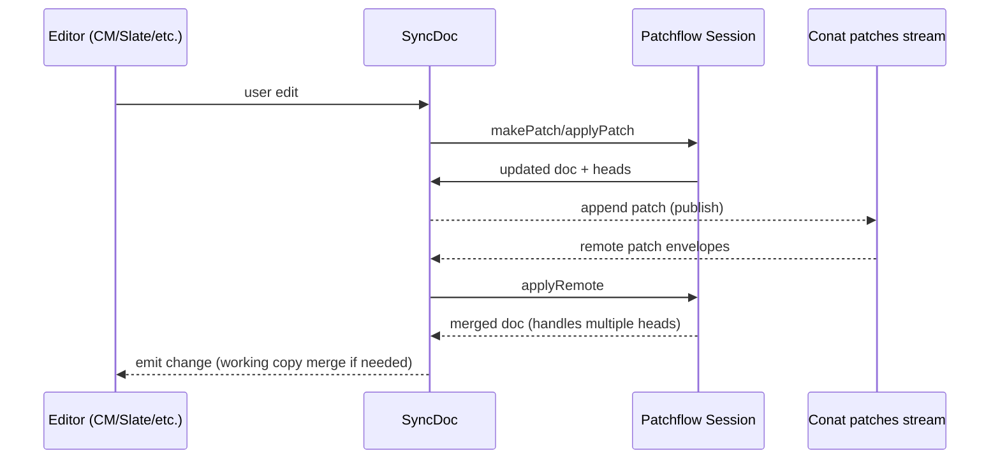
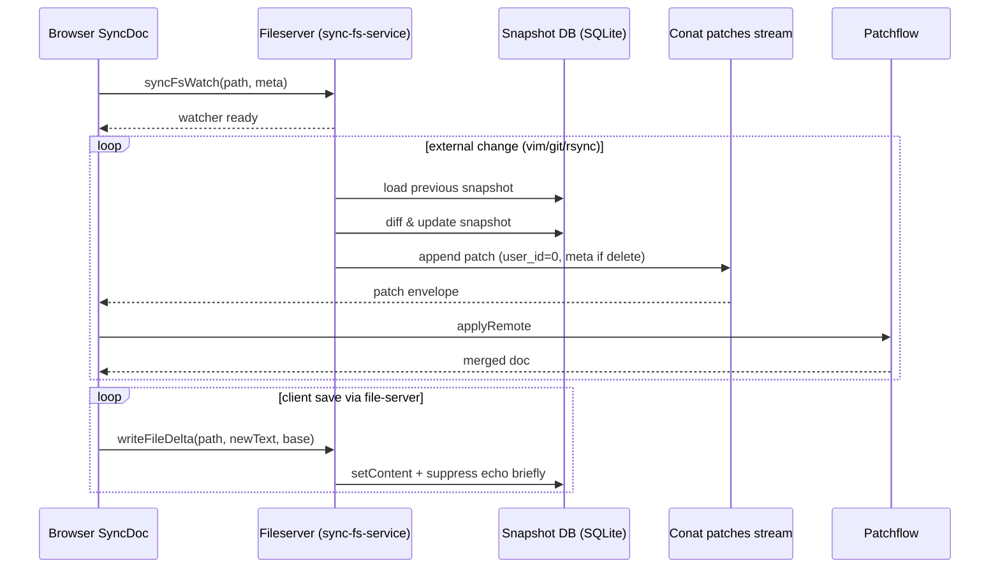

CoCalc Sync Overview
====================

This is how realtime document sync works in CoCalc after the [Patchflow](https://github.com/sagemathinc/patchflow) refactor, including how filesystem edits are integrated.

High‑level data model
---------------------
What owns the patch DAG, what adapts it to editors, and where state is persisted is as follows:

- **Patchflow session**: per document, holds the DAG of patches (with snapshots), merge logic, history, presence, undo/redo.
- **SyncDoc**: front/back shared TypeScript class that owns a Patchflow session, adapts it to editor APIs, and persists patches via Conat streams.
- **Conat streams**: append-only persistence for patches (`patches` stream) and metadata (`syncstring` table). Streams are identified by `string_id` (sha1 of project_id + path).

Patchflow flow
--------------
Edits flow from editors into SyncDoc, through Patchflow, out to persistence, and back as remote patches:

Patch IDs, ordering, and streams
-------------------------------
- **PatchId format**: In Patchflow ≥0.5.0 every patch uses an opaque `PatchId` string: `<time36>_<client>`, where `time36` is a fixed‑width base36 logical timestamp prefix and `client` is a per‑session random suffix. This removes collisions when the same user commits from multiple clients. Legacy numeric times are auto‑adapted on load.
- **Deterministic ordering**: Heads are merged by sorting PatchIds lexicographically; the time36 prefix preserves chronological order, and the random client suffix breaks ties deterministically.
- **Streams as storage**: Patches are appended to a Conat stream (`patches`), not mutated in place. Stream sequence numbers are broker-assigned; PatchIds remain stable across transports, so streams can be replayed or copied between brokers without renumbering patches.

Key behaviors
-------------
These are the guarantees and behaviors Patchflow/SyncDoc provide: handling multiple heads, working-copy merges, presence, and undo/redo. They are the contract the rest of the system relies on.

- **Multiple heads**: Patchflow merges DAG heads deterministically (PatchId ordering) by replaying patches; snapshots cap history size.
- **Working copy merge**: Editors may diverge locally; SyncDoc can merge remote commits into a live buffer using three-way merge (strings) or structured patch replay.
- **Presence/cursors**: Patchflow presence adapter tracks cursor positions; SyncDoc exposes them to editors.
- **Undo/redo**: Patchflow tracks undo pointer; SyncDoc maps editor commands to Patchflow undo/redo and creates commits as needed.

Filesystem integration
----------------------
Disk changes enter the same patch stream that editors use: a single backend watcher diffs disk against stored snapshots, emits patches with a reserved user, and clients converge via Patchflow. It’s the bridge between the filesystem and the realtime DAG.

- **Streams & seq**: Both the `patches` stream and the metadata synctable are Conat streams; patch envelopes keep their PatchIds, while the stream assigns a monotone `seq` used only for incremental fetch (`start_seq`) and watcher resume.
- **Deployment note**: the fileserver runs one shared watcher service with a durable SQLite file (e.g., `data/sync-fs.sqlite` via `new SyncFsService(new SyncFsWatchStore(join(data, "sync-fs.sqlite")))`), so heads/lastSeq survive restarts and streams resume with `start_seq` instead of replaying history.
- **Backend watcher (sync-fs-service)**:
  - One chokidar watcher per directory on the fileserver; heartbeats from clients keep watches alive.
  - Stores last-on-disk snapshot in a lightweight SQLite DB (diffable without replaying patch history).
  - On external change:
    - Computes patch vs stored snapshot (diff-match-patch).
    - Appends a Patchflow-compatible patch to the `patches` stream with `user_id=0`; for deletes, sets `meta.deleted: true`.
  - Tracks stream head/version and last seq to incrementally read stream (`start_seq`) instead of replaying everything.
- **Local writes via file-server**:
  - `writeFileDelta` updates the stored snapshot and optionally suppresses echo of the immediate fs event.
  - Saves avoid shipping full files: the file-server computes a delta against the last on-disk content and transmits only the patch (or a small diff), so multi‑MB files don’t churn the network on every save.
  - Suppression is time-limited; missed fs events do not block updates.
- **SyncDoc side**:
  - No direct fs.watch in the client anymore.
  - On init, SyncDoc calls `fs.syncFsWatch(path, true, meta)` to register interest; periodic heartbeats keep it alive.
  - Incoming patches with `meta.deleted` trigger `deleted` events; other patches merge normally through Patchflow.

Filesystem flow
---------------
The following diagram walks through the lifecycle of a disk edit: registration of interest, backend diffing, patch emission, and client merge. It mirrors the narrative above so you can see timing and responsibilities.

Operational notes
-----------------
These are the practical rules and constraints that make the system reliable in production: userId bucketing, snapshot heuristics, delete handling, and caching/locking choices. Think of this as the operator’s checklist.

- User IDs are bucketed (<1024) to guarantee unique logical times; fileserver uses user_id=0.
- Snapshotting: Patchflow uses `snapshot_interval` and size heuristics; SyncDoc can request snapshots based on history/size.
- Deleted handling: when fs reports delete, backend emits a delete patch; SyncDoc sets `isDeleted` and emits `deleted`, but content is also cleared so editors close cleanly.
- Caching/performance: Patchflow caches applied values; sync-fs-service caches stream heads/versions/seq to avoid full scans; SQLite uses WAL+busy_timeout to reduce lock errors.

Key code paths
--------------
These are the source files that implement the described behavior, so you can jump straight to code when needed.

- SyncDoc: [src/packages/sync/editor/generic/sync-doc.ts](../src/packages/sync/editor/generic/sync-doc.ts)
- Patchflow session/graph: `patchflow/src`
- Backend fs watcher: [src/packages/backend/sandbox/sync-fs-service.ts](../src/packages/backend/sandbox/sync-fs-service.ts), [src/packages/backend/sandbox/sync-fs-watch.ts](../src/packages/backend/sandbox/sync-fs-watch.ts)
- File-server API wrapper: [src/packages/conat/files/fs.ts](../src/packages/conat/files/fs.ts)

Open edges / expectations
-------------------------
There are some nuanced behaviors and caveats: merge determinism, non-string merge limits, watcher lifetimes. It’s a reminder of what to expect and where further work might live.

- Merges are deterministic but order-dependent on logical time; heads are merged on receipt.
- Working-copy merges for non-string docs rely on structured patches (no diff3); string docs can use three-way merge when local edits diverge.
- Backend watcher uses directory-level chokidar; if heartbeats stop, watch is pruned and will re-arm on next heartbeat.
