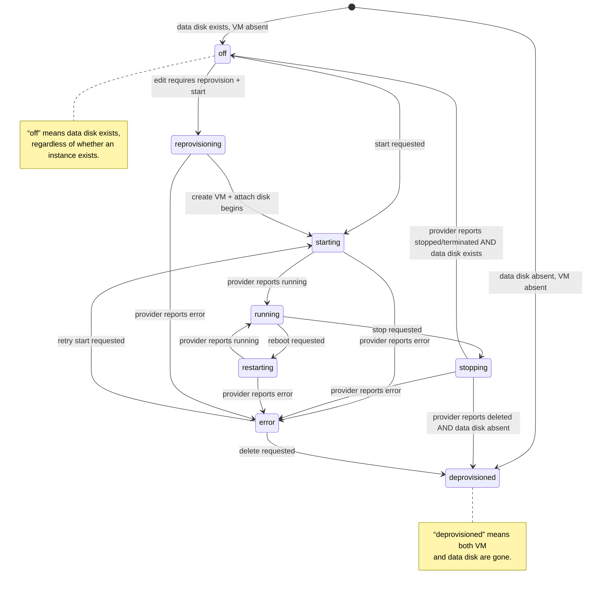

# Systematically getting cloud to robustly work

## State Reconciliation

Goal: keep `project_hosts.status` aligned with actual provider state, without
flapping or masking in-flight transitions. This should follow best practices
from managed services (GKE, Cloud SQL, RDS, etc.), where control-plane state
is distinct from data-plane readiness.

Treat the provider as the source of
truth for *runtime state* and the control plane as the source of truth for
*desired state*.

### State Model

- **Desired state**: last user action (start/stop/reprovision/delete).
- **Observed state**: provider VM state + data volume existence.
- **Off semantics**: VM may be absent, but the data volume exists.
- **Deprovisioned**: VM absent *and* data volume absent.

### State Definition Decisions (Managed Services Convention)

These rules mirror common managed-service semantics where VM lifecycle and
service readiness are distinct.

1. **Running vs Active**
   - **running**: provider reports the VM is running.
   - **active**: project-host heartbeat is present (daemon alive).
   - **heartbeat gating**: ignore heartbeats unless current status is already
     `running`/`active`, so a host shutting down cannot flip state back to
     running mid-stop.
   - UI should show both if possible (e.g., “running / host offline”).
2. **Starting with no IP**
   - If provider says running but no IP/tunnel yet, keep **starting** until
     IP/tunnel appears or a timeout is reached.
3. **Bootstrap pending**
   - VM running with bootstrap incomplete remains **running** with a sub-status
     “bootstrap pending.”
4. **Failure semantics**
   - A failed API call never flips state.
   - Only update state on successful provider responses.
5. **Off vs Deprovisioned**
   - **off**: VM absent/stopped *and* data disk exists.
   - **deprovisioned**: VM absent *and* data disk absent.
6. **Reconcile precedence**
   - Provider state wins after N confirmations (e.g., 2 polls), except within
     a grace window of a user action.
7. **Self-host**
   - If connector offline, show **unknown** (not off) with last-seen info.
   - VM state + connector heartbeat determines running/active.

### Normalized State Diagram

### Provider Mapping

Each provider maps its raw status to normalized:

- `running`, `starting`, `stopping`, `off`, `error`, `deleted/absent`

Additionally, we must query the **data volume** (where applicable) to decide
`off` vs `deprovisioned`.

### Reconciliation Loop

- Periodically poll hosts that are:
  - `starting`, `stopping`, `reprovisioning`, `error`, or stale `last_seen`
  - OR have missing `runtime.public_ip`
- For each host:
  - Fetch provider VM status (if VM exists).
  - Check data volume existence (if provider has persistent disk).
  - Update `metadata.runtime.provider_status` and `metadata.runtime.observed_at`.
  - Reconcile:
    - VM exists + running → `status=running`
    - VM absent + volume exists → `status=off`
    - VM absent + volume absent → `status=deprovisioned`
    - VM stopping/deleting → keep `status=stopping`
    - VM error → `status=error`
  - Clear stale `public_ip` if VM missing.

### Guardrails

- **Grace window**: don’t override `last_action` outcomes for N minutes
  after a state change to avoid fights with start/stop actions.
- **Unknown vs off**: a single failed API call should not flip state; require
  two consecutive confirmations for “missing”. 
- **Rate limits**: cap hosts per tick, exponential backoff per provider.
- **Hyperstack reserved volumes**: treat “reserved” as transitional, not failed.
- **DNS/Cloudflare lag**: avoid flipping to error solely for missing IP; allow
  DNS setup to proceed after `running`.

### UI Edge Cases

- Show both:
  - **Control\-plane status** \(e.g., “stopping”\)
  - **Provider observed status** \(e.g., “stopping/deleting”\)
- If a host is stale \(`last_seen` old\), show “stale” badge and encourage
  “Refresh state” or “Reconcile now”.
- Keep UI simple: if data disk exists, treat as `off`; only show `deprovisioned`
  when both VM and data volume are gone.
  - if the VM is deprovisioned but the data disk exists, we just show this as "off", not "deprovisioned".   There's no need to add complexity to the UI purely due to weirdness of cloud providers.  E.g., technically an off machine on GCP and an off machine on Hyperstack are basically identical \-\- it's some bytes on block devices; but GCP has an abstraction of an "instance" in that case, and hyperstack doesn't.  

### Action-Level Waiters (Fast, Accurate Transitions)

When a user clicks Start/Stop/Reboot/Deprovision:

- Set a transitional status (`starting`, `stopping`, `restarting`).
- Wait for provider confirmation:
  - Prefer “wait” APIs when available (e.g., GCP operations).
  - Otherwise poll provider state on a short interval (e.g., 5–10s) until
    the normalized target state is reached or timeout.
- Only then update `project_hosts.status` to the final state.

This reduces UI drift and avoids “off” while the VM is still stopping.

### Implementation Plan

1. Centralize provider state normalization \(single map to `starting|running|stopping|off|error|deprovisioned|unknown`\).
2. Add provider “status probe” functions \(VM status \+ data volume existence\).
3. Action waiters for Start/Stop/Reboot/Deprovision:
   - set transitional state immediately
   - block on provider “wait” or poll
   - finalize only after provider confirmation
   - provider-by-provider:
     - \(done\) GCP start/stop waits for RUNNING/TERMINATED after the API call
     - \(done\) Nebius wait on instance state after start/stop
     - \(done\) Hyperstack wait on instance state after start; stop waits for delete
     - \(done\) Lambda uses deprovision semantics; wait for delete complete
     - \(todo\) Self-host wait for connector-reported state change
4. Reconciliation job:
   - runs every 2–5 minutes
   - updates `metadata.runtime.provider_status` \+ `observed_at`
   - reconciles `project_hosts.status` with guardrails
5. Guardrails:
   - \(done\) grace window for in\-flight actions
   - \(done\) require 2 consecutive “missing” results before marking off/deprovisioned
   - \(todo\) backoff and per\-provider caps
6. UI:
   - \(done\) show normalized status \+ observed provider state
   - \(done\) show online/offline badges with tooltips
   - \(done\) hide Stop for ephemeral providers (e.g., Lambda)
7. Smoke tests:
   - \(done\) minimal provider-status check per step (skip when action pending)
   - \(todo\) run reconcile after stop/start to validate the loop

---

## \(done\) Issues Observed \(From Smoke Runs \+ Manual Checks\)

- **Data disk re\-formatted on reprovision**: editing a stopped host and starting can wipe `/btrfs` \(Nebius repro shows empty project dir, root\-owned, no snapshots\). Suspect bootstrap is re\-running `mkfs` because sentinel is missing on a reattached disk.
- **Project subvolume ownership**: after reprovision, project dir is owned by root and `.snapshots` creation fails. Likely a consequence of disk reformat, but guard should still ensure correct ownership.
- **sshpiperd install failure on first boot**: project\-host may fail to start on first boot even though sshpiperd exists in `/opt/cocalc/tools/current`. Should prefer tools path before install.
- **Host heartbeat/status drift**: if project\-host daemon dies, control plane still shows stale “running” until a manual refresh. Need periodic heartbeat with staleness detection.
- **Cloud transitional state drift**: UI often shows “off” or “deprovisioned” while provider still stopping/starting. Need periodic reconciliation against provider APIs.
- **Hyperstack stop/start race**: after stop \+ update, start fails with “host status became error”, likely because the VM or disk isn’t fully detached before start.
  - this is because the VM still exists.  It's the "**Cloud transitional state drift" above.**
- **DNS propagation race**: project host can be reachable, but local DNS caches NXDOMAIN, causing startProject timeouts. \(Not a smoke failure anymore, but still a real UX issue.\)
  - how to solve this? I think we need careful gating \- make sure a browser doesn't try until dns is setup?  don't return the host\_id until we successfully setup dns and don't remove the dns entry should do it.
- **Lambda stop UX**: deprovisioning can take longer than UI reflects. Needs a clearer “deprovisioning” wait state based on provider delete completion.

## Todo List (Ordered)

1. **Nebius reprovision disk safety**: detect existing btrfs filesystem and skip `mkfs` when a data disk is already formatted (even if sentinel is missing).
2. **Project subvolume ownership guard**: ensure `/btrfs/project-<id>` and `.snapshots` are owned by ssh user before use.
3. **sshpiperd install path**: always prefer `/opt/cocalc/tools/current/sshpiperd` on first boot; avoid “install” failure.
4. **Heartbeat + staleness**: add periodic project-host status update to control plane; mark host stale/offline if `last_seen` is too old.
5. **Provider reconciliation loop**: periodically reconcile cloud provider state with `project_hosts.status` to fix drift.
6. **Hyperstack stop/start gating**: ensure stop fully completes before reprovision/start (wait for provider state and disk visibility).
7. **DNS race mitigation**: retry on initial failures or delay project start until DNS is resolvable.
8. **Lambda deprovision wait**: keep status “stopping/deprovisioning” until the provider confirms deletion.

## Current Focus

- **Nebius reprovision disk safety**: stop `mkfs` on already-formatted data disks and preserve `/btrfs` across reprovision/start.
