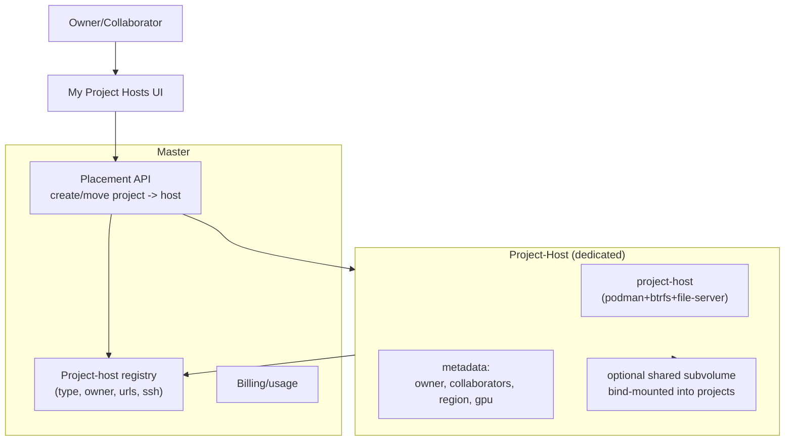
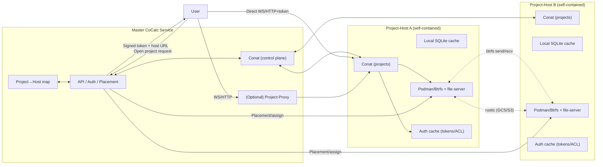

## Implement Project Hosts (replaces compute servers)

### Misc to not forget:

- [ ] when implementing starting remote project host, be sure to do set all secrets via safe 0600 files and not env variables. e.g., cloudflare r2.

### Make “add a new cloud” mostly one‑place changes

Right now the provider logic is split across host‑work, reconcile, catalog, and UI. We can centralize with a registry pattern:

1. **Provider registry** \(in @cocalc/cloud\)  
   Define a `CloudProvider` interface and a `providers` map keyed by provider id.  
   Example interface:

- `fetchCatalog(): Promise<NormalizedCatalog>`
- `createHost(spec, creds): Promise<Runtime>`
- `startHost(runtime, creds)`
- `stopHost(runtime, creds)` \(or throws if unsupported\)
- `deleteHost(runtime, creds)`
- `getInstance(runtime|instanceId, creds): Promise<Runtime|null>`
- `listInstances(prefix, creds): Promise<Runtime[]>`

Then server code calls into `providers[id]` instead of `if/else` chains.

2. **Capabilities descriptor**  
   Add a provider capabilities map \(e.g., `supportsStop`, `supportsDiskType`, `supportsDiskResize`, `supportsCustomImage`, etc.\).  
   Use it in:

- host‑work \(stop → delete if unsupported\)
- UI \(hide fields that don’t make sense per provider\)

3. **Catalog integration**  
   `server/cloud/catalog.ts` should call `providers[id].fetchCatalog()` and write to `cloud_catalog_cache` in one place. That means adding a new provider mostly requires adding its fetchCatalog in @cocalc/cloud.

4. **Reconcile integration**  
   `server/cloud/reconcile.ts` should iterate through `providers` and call `listInstances` or `getInstance` via the registry.  
   That eliminates per‑provider switch logic in reconcile and avoids missing “new cloud” cases.

5. **UI integration**  
   UI should be driven by:

- `providers` list \(what’s enabled\)
- provider capabilities \(fields shown\)
- catalog \(regions/zones/flavors/images\)  
  So “adding a new cloud” is: implement provider \+ fetch catalog; the UI should “just show it.”

That way, Nebius is “add provider \+ catalog,” not touch 10 files.

### Cloud VM control layer.

Goal: a provider‑agnostic control plane in `@cocalc/cloud` that can provision, start/stop, and meter project‑host VMs via cloud APIs, with concurrency handled in Postgres (no singletons), and costs/usage recorded as immutable log events. The hub owns orchestration and billing, while providers expose clean, testable adapters.

**Remote project-host bring-up checklist (current code):**

- [ ] **GCP end‑to‑end boot**: VM provisions with boot+data PD, injects SSH key, runs startup script to install podman+btrfs, mounts PD at `/btrfs`, copies SEA, starts project‑host, registers with hub, and DNS is created.
- [ ] **Hyperstack end‑to‑end boot**: create environment (idempotent), create VM from catalog, inject SSH key, run bootstrap, register with hub, DNS set.
- [ ] **Lambda provider**: adapter + catalog + create/start/stop/delete wired into work queue.
- [ ] **Bootstrap inputs**: define minimal config files for hub URL, conat secret, host_id, and backup config (no env secrets); install via SCP/metadata.
- [ ] **SSH connectivity**: ensure cloud provider injects host SSH public key and we can `ssh` in as the service user.
- [ ] **Runtime reconciliation**: periodic status check to reconcile provider state → `project_hosts.status` (avoid “running” UI on failed boot).
- [ ] **Error surfacing**: show last action + error from `cloud_vm_log` in host card + drawer; confirm failure states update.
- [ ] **DNS**: ensure Cloudflare record is created (or fallback proxy), and public_url uses DNS name not raw IP.

**Minimal provider interface + simple mode (v1):**

- Provider API: `catalog`, `createHost`, `startHost`, `stopHost`, `deleteHost`, optional `status`.
- Simple mode maps `{region, cpu, ram, gpu?}` to the smallest compatible instance; advanced settings are hidden behind a toggle.
- Do not block on pricing/egress; keep usage tracking as log events for now.

**Multi‑cloud plan (Day‑1 providers):**

1. **GCP**: already wired; use catalog for regions/zones/machine/gpu/images; boot+data disks; DNS via Cloudflare.
2. **Hyperstack**: port the existing client from `server/compute/cloud/hyperstack` into `@cocalc/cloud` (no `@cocalc/server` deps), then adapt create/start/stop/delete to the minimal interface.
3. **Lambda Cloud**: implement minimal REST client + catalog; keep only simple mode; no spot/resize/custom images initially.

**Implementation/testing plan (cloud):**

1. Add normalized catalog to `@cocalc/cloud` with tests.
2. Add provider adapters for GCP/Hyperstack/Lambda.
3. Keep advanced knobs behind UI toggle; default to simple mode.
4. Add work‑queue worker + tests for cloud actions.
5. Add admin “refresh catalog” RPC + UI (already started for GCP).

**API surface (provider‑agnostic):**

- `createHost(spec, creds) -> runtime` (attach boot+data disks, inject bootstrap)
- `startHost(runtime, creds)`
- `stopHost(runtime, creds)`
- `deleteHost(runtime, creds)`
- `resizeDisk(runtime, newSizeGb, creds)`
- `getStatus(runtime, creds) -> starting|running|stopped|error`
- `getPricing(spec|machineType, region) -> pricing` (optional, cached)
- `estimateCost(spec, duration, storageGb, egressGb) -> estimate` (optional)

**DB model (new tables):**

- `cloud_vm_log(vm_id, ts, action, status, provider, runtime, spec, pricing_version, error)`
  - append‑only event log (create/start/stop/delete/resize/status updates)
- `cloud_pricing_cache(provider, sku, region, unit_price, fetched_at, ttl, pricing_version)`
  - optional, cached daily; referenced by estimates
- `cloud_vm_usage(vm_id, ts, cpu_hours, storage_gb_hours, egress_gb, source, confidence)`
  - optional; supports delayed provider billing reconciliation

**Locking / orchestration pattern (Postgres):**

- Use `SELECT ... FOR UPDATE SKIP LOCKED` on a work queue (or host row) to ensure only one hub instance executes a provisioning step per VM at a time.
- Each action appends to `cloud_vm_log` and updates `project_hosts.status`/`metadata.runtime`.
- Idempotent actions: if a host already exists in provider, `createHost` should return existing runtime.

**Costing strategy:**

- Prefer provider pricing APIs (GCP billing catalog, Hyperstack API) cached daily.
- Use estimates for immediate UI; reconcile later if provider cost data arrives.
- Store `pricing_version` in `cloud_vm_log` for auditability.

**Capabilities / constraints:**

- Track host capabilities (supports btrfs/overlayfs/snapshots/quotas) via `runtime.metadata.capabilities`.
- For “container‑only” providers (e.g., runpod), disable snapshots and use full‑rootfs copy.

**Implementation / testing plan:**

1. Implement tables and lightweight log helpers in `packages/server/cloud` (new module).
2. Add a `cloud_vm_work` queue table to drive provisioning actions (start/stop/resize) with SKIP LOCKED.
3. Extend `@cocalc/cloud` interface with optional pricing/estimate methods; stub for GCP.
4. Wire `hub.hosts.*` to enqueue actions and return immediately; workers update status/logs.
5. Add LocalProvider tests (already) + mocked GCP tests; add worker tests that assert log writes and locking semantics.
6. Add a minimal pricing cache test (uses a fake provider).

### Current focus: project --> project host configuration

Our current focus is the frontend UI for users to manage and select where their projects run and the corresponding backend
to support this.

- **Step plan \(user‑owned project hosts\):**
  1. \(done\) Surface host moves in UI: add shared host\-picker modal \(personal \+ shared/admin hosts\) and wire it into Project Settings “Move”, project Servers tab \(“Project Hosts”\), projects list row menu, and later bulk moves.
  2. Allow admin visibility: Hosts list RPC returns `shared` \+ owner when admin; Hosts page shows admin controls \(toggle shared, inspect any host\); picker filters to owned/collab \+ shared \(admin can see all\).
  3. \(done\) Back the picker with placement API: ensure `requestMoveToHost` accepts any host\_id the user can access; reject others; mark current host in UI.
  4. \(done\) Create\-on\-host flow: from Servers tab or Hosts page, let user spawn a new host \(local/dev placeholder\), then create a project directly on that host.
  5. Add light polling/changefeed for host lists so status updates \(starting/running/off\) are reflected without manual refresh; reuse bootlog stream for detailed start/stop feedback.
  6. Gate shared pool entries: add metadata \(region, caps, cost\) to hosts list; group “Your hosts” vs “Shared pool”.

- **Backup config distribution (hub‑mediated):**
  - [ ] Add `hub.hosts.getBackupConfig({ host_id }) -> { toml, ttl_seconds }` (no account auth; allow hub connection only).
  - [ ] Implement server handler to build provider‑agnostic rustic TOML from site settings (R2/S3/GCS/etc.); return empty TOML if not configured.
  - [ ] Project‑host: fetch backup config on startup, write `secrets/rustic.toml` with `0600`, and use that path for rustic.
  - [ ] Add TTL cache + refresh on expiry and on auth errors (401/403); keep env‑based fallback only for dev.
  - [ ] (Later) Add a conat invalidate signal so hub can force refresh after key rotation.
  - [ ] Document in `docs/project-backups.md`.

### Next focus: automated running of project hosts on cloud VM's

The next focus will be actually starting project hosts on actual VM's using cloud api's.

- **Step plan \(cloud project-host provisioning\):**
  1. Add `src/packages/cloud` with a provider‑agnostic interface and a minimal GCP adapter skeleton.
  2. Implement GCP `createHost/startHost/stopHost/deleteHost/resizeDisk/getStatus` using existing compute server helpers (DNS, credentials, startup scripts) as references, but with simpler VM assumptions.
  3. Add bootstrap script: install podman + btrfs, format/mount PD, install project‑host bundle, start service.
  4. Wire `hub.hosts.*` to call the cloud adapter when `metadata.machine.cloud === "gcp"` and update `project_hosts` with runtime metadata.
  5. Add DNS hookup via Cloudflare helper (reuse compute/dns.ts), optional in dev.

### Overall Plan

Dedicated project-hosts replace “compute servers”: users provision a VM (often with one or more GPU's), we boot a project-host on it, and they and their collaborators create/run normal projects on that host while it’s up. The master keeps the host registry and placement map; hosts register with metadata (`type: dedicated`, `owner`, region, URLs, ssh). There’s no legacy migration—schema can change freely. Storage options include local Btrfs, optional shared subvolumes bind-mounted into projects, and user-supplied object storage via gcsfuse (API keys). Frontend must give a “manage my hosts” experience: create/start/stop hosts, view costs/usage, add collaborators, and create/move projects onto a chosen host.

**Compute Servers → Dedicated Project Hosts (Todo)**

- [ ] Data model: drop compute_servers concept; extend `project_hosts` with owner_account_id, type=dedicated, metadata (region/size/GPU, billing ref), allowed collaborators list/policy, public/internal URLs, ssh_server.

- [ ] Provisioning: reuse `packages/servers/compute` to create VMs; install/start project-host with owner credentials + master endpoint; ensure host registers on boot/shutdown and marks type=dedicated.

- [ ] Auth/ACL: owner always allowed; collaborators allowed to create/use projects on that host; enforce via host-side checks pulled from master; no root on VM (only podman).

- [ ] Projects on host: create/move projects onto a chosen dedicated host (placement API); projects unavailable when host is stopped; support bind-mounted shared Btrfs subvolume (rw/ro) for projects on the same host.

- [ ] Storage: default local Btrfs; optional gcsfuse-mounted bucket via user-provided API key; keep snapshots/backups per project as today.

- [ ] GPU/Resources: ensure podman runs with host GPU (nvidia setup) when VM has GPU.

- [ ] Frontend: new “My Project Hosts” UI to list/start/stop hosts, show costs/usage, manage collaborators, and “New project on this host”; replace legacy “compute server tied to a project” flows; projects view shows host info.

- [ ] Routing: master returns host endpoints; existing multi-conat routing handles per-host sockets; no iframe.

- [ ] Billing/limits: track runtime per host for charging; surface quotas/headroom in UI.

**Mermaid**

## Checklist for beta release

- [ ] eliminate this: src/packages/conat/project/runner/load-balancer.ts

- [ ] bootlog seems flakie -- sometimes it isn't connected

- [ ] restore from backup for a larger restore:
    - blocks screen with modal for ~15s...
    - then times out and gives error
    - but it definitely works!
    - obviously fully restoring and starting project duriong restore would be very bad.

- [ ] suggested image list \(e.g., ubuntu:25.10\) and fallback behavior.
   - have an advanced checkbox so people can enter any image with appropriate caveats

- [ ] rewrite stopIdleProjects to use new architecture \(and everything that used the old project runner load balancer code\)

- [ ] Kubernetes support

- [ ] fuse mount support via a sidecar container, for functional parity with cocalc.com today
   - [ ] sshfs
   - [ ] s3 buckets

- [ ] Reflect sync path sharing.
  - [ ] internal to a project\-host; currently uses mutagen, so rewrite to use reflect\-sync
  - [ ] between two project\-hosts
  - [ ] implement a frontend UX for configuring this

- [ ] implement /scratch for projects:
  - [ ] a btrfs subvolume on a configurable btrfs fs; by default same as project, but could be configured to be a different btrfs
  - [ ] no snapshots or backups of any kind
  - [ ] deleted when project is moved
  - [ ] restore backups to /scratch not \$HOME/scratch
    - this requires actually having /scratch as a separate volume, which we don't have right now, evidently

- [ ] Compute servers = dedicated/owned project hosts
  - [ ] treat compute servers as user\-scoped project\-hosts with reflect\-sync subset sharing; 
  - [ ] API for spinning up temporary hosts
  - [ ] drop project\_id column from compute\_servers in favor of host auth/ACL.

- [ ] There are api calls/functions for things like "execute code on project" \-\- these will need to send a message to the relevant project\-host and back.

- [ ] Project activity \-\- when project is being used, etc. \-\- needs to get updated regularly from the project host to master.

- [ ] Security: Right now technically project\-hosts allow users to directly create projects on them, which should not be allowed \(though not via UI\). Even worse, user can specify the project\_id, which is a major security issues. See src/packages/project\-host/hub/projects.ts

- [ ] Security: When setting a project we always add the default cocalc\-lite account so we can keep things working: " // [ ] TODO \-\- for now we always included the default user; this is obviously temporary"  

- [ ] #security: src/packages/server/conat/route\-client.ts currently gives away the master hosts secret auth to any project\-host, which of course isn't good.

- [ ] eliminate payg \(=pay as you go\) entirely for projects
  - easy: just hide a box in the ui...

- [ ] Backups \-\- Rustic/GCS backup pipeline with retention tags per project/host; per\-host health checks.
  - [ ] creating larger backups errors in the frontend due to timeout \(backup is created\).

- [ ] implement clone but to another project-host.
   - this is exactly like move but without snapshots, a differnet target project_id, and don't delete the source.

- [ ] delete project data permanently

## Checklist for public release

- [ ] security: use forcecommand for btrfs container

- [ ] Project lifecycle not enforced during moves \-\- the source project isn’t blocked \(including sandboxed file ops\) before the send, so writes could race.

- [ ] finish SEA binary for running project\-host:
  - [ ] include binaries
  - [ ] allow user to select where project is hosted for easier testing \(could be hidden dev feature\)

- [ ] Harden auth: signed connect tokens; enforce project ACLs for start/stop/open; remove anonymous access paths in project\-host hub/conat services.
  - [ ] Issue short\-lived signed tokens \(project\_id \+ perms \+ exp\) from master when opening a project
  - [ ] browser uses them to open `wss://<host>/conat` directly. 
  - [ ] Hosts validate tokens locally.

- [ ] Project host networking: 
  - [ ] keep non\-host networking but guarantee containers can reach the host conat endpoint
  - [ ] consider explicit hostfwd mode if we ever bind conat to loopback only.

- [ ] Observability:
  - [ ] per\-host metrics/logs
  - [ ] minimal status page \(runner/file\-server/conat\)
  - [ ] project lifecycle spans
  - [ ] alerts for failed moves/backups and low headroom.

## Checklist for later

- [ ] Proxy ingress: 
  - [ ] project\-proxy base\-path
  - [ ] SSH/HTTP ingress for hidden/on\-prem hosts

- [ ] \(later\) POSIX File\-server that doesn't require btrfs \(no snapshots or quotas, but has rustic backups\). This would make it possible to support running the entire project\-host purely in userspace \(with podman\) on both Linux and MacOS. Also won't use overlayfs for containers since that also requires root.

- [ ] \(later\) Advanced use of backups:
  - [ ] restore project from a backup to a given project\-host
    - first do restore,
    - then delete project from whatever other host it was on
  - [ ] surface restore as a way to access a project that is on a broken/gone/vanished host. For compute servers, this could be very important: make sure all projects are backed up, then deprovision

## CoCalc New Architecture Plan (federated project-hosts + proxy)

- **Roles**
  - Master: central API/auth/placement; holds project→host map; issues signed connect tokens; optional proxy fallback.
  - Project-host: self-contained runner/file-server stack (podman + Btrfs + conat + tiny sqlite cache); no user creation or global changes; serves multiple projects.
  - Project-proxy: separate service for SSH/HTTP/WebSocket ingress when direct host access isn’t possible.

- **Control-plane contracts**
  - Host registration/keepalive to master (ID, region, public URL/tunnel handle, health, capacity).
  - Placement APIs: assign/move project; master returns signed user tokens + host URL.
  - Auth cache on host with push/TTL invalidation from master; hosts can serve with cached ACLs for a bounded TTL if master is slow/unreachable.

- **Data-plane routing**
  - Preferred: user → project-host directly with a signed token (project, user, expiry, host) over a dedicated conat socket per host (master socket stays separate).
  - Fallback: user → project-proxy → host using the same token validation.
  - Routing lookup lives in master; host identity via per-host cert/keys. Keep proxy optional but available for restrictive networks.

- **Compute servers (recast as project-hosts)**
  - Compute servers become user-owned project-hosts (powerful VMs, often GPU). No `project_id` column; access controlled by host ACL.
  - Users sync/copy data between projects (reflect-sync/btrfs send) instead of remote-mounting a project FS.
  - Must support userspace-only deployments (podman) for HPC/on-prem; registration + auth is the same as any host.

- **Service extraction/refactors**
  - Keep [file-server](./packages/file-server) embedded in project-host; remove “central file-server” assumptions in [packages/server/conat/file-server/index.ts](./packages/server/conat/file-server/index.ts).
  - Extract SSH/HTTP proxy pieces into [packages/project-proxy](./packages/project-proxy) (move code from [packages/file-server/ssh](./packages/file-server/ssh) and relevant parts of [packages/server/conat/file-server/index.ts](./packages/server/conat/file-server/index.ts)).
  - Add host-local conat instance per host; master uses conat only for control-plane topics.

- **Project moves and storage**
  - Moves: snapshot + `btrfs send/recv` between hosts; update project→host map; optional delta/cutover; validate and clean source. Also move all persist sqlite stores!
  - Backups: per-host Btrfs snapshots + rustic to object storage; tag snapshots/backups with project IDs for audit/GC. Also backup all persist sqlite stores.
  - PD/Btrfs as primary; optional SSD cache layer later.

- **Hidden/on-prem hosts**
  - Connector abstraction: direct TCP in-cluster; reverse tunnel (SSH/WireGuard/QUIC) for hidden hosts; project-proxy aware of transport.
  - Host bootstrap includes master URL/credentials; hidden hosts register via reverse channel but otherwise share the same APIs.

- **Security/auth**
  - Signed user tokens validated on host and proxy; hosts cannot mint users/projects.
  - Rate limits per project/host; audit logs for token and ACL decisions.

- **Observability and ops**
  - Metrics: host health, auth cache hit/miss, master latency, project count, disk/headroom, backup freshness, move success.
  - Alerts: stale project→host map, failed host dial, token validation failures, low headroom.
  - Runbooks: add host, move project, rotate keys, restore, handle master outage policy.

- **TODOs carried forward**
  - Tighten project-proxy HTTP handler to enforce a base path/length before slicing project_id.

- **Rollout steps**
  1. (done) Embed file-server in project-host; add host registration + project→host map in master.
  2. Implement signed connect tokens and direct user→host path; keep proxy fallback.
  3. Implement project move workflow (btrfs send/recv) and backup tagging.
  4. Pilot a small pool in one zone; test offline/TTL behavior, direct vs proxy, moves/backups; add observability.
  5. Add reverse-tunnel connector for hidden/on-prem hosts without changing routing core.

## Diagram

Mermaid sketch of master + project-host federation:

## TODO: Misc Things to not forget

- [ ] \(later\) automatically start project on _successful_ ssh attempt.
  - I don't know how to do this, except by possibly having to fork sshpiperd or rewrite that plugin... but that's fine.

## Completed

- [x] snapshots break when there is a non-snapshot in the .snapshots directory: "WARNING: Issue updating snapshots of 7f8daff5-720d-40e1-8689-1d2572a42811 Error:  ''sudo' (args=btrfs subvolume show /home/wstein/scratch/btrfs2/mnt/0/project-7f8daff5-720d-40e1-8689-1d2572a42811/.snapshots/move-1765222048772)' exited with nonzero code 1 -- stderr='ERROR: Not a Btrfs subvolume: Invalid argument"

- [x] Clone project \-\- doesn't work \(uses old load balancer/project runner model?\)  

- [x] Quota/usage widget missing in the explorer

- [x] Image selection has no effect

- [x] if starting a project takes more than about 10s, e.g., due to rootfs pull, then get an error.  Fix - change the api to to just make the project start starting and return immediately; it doesn't wait until done.  There's the bootlog and database/changefeed statechange for info about what happens.  There can be an *option* to wait, for clients that select a longer timeout.

- [x] Backups \-\- Rustic/GCS backup pipeline with retention tags per project/host; per\-host health checks.

- [x] implement move project using btrfs
  - [x] deleting snapshot fails after a move \(some stale state somewhere on the backend; not sure\)
- [x] expose image/pull errors cleanly

- move
  - [x] snapshot creation after move broken due to missing qgroup \(?\)
  - [x] **Snapshots not preserved:** we only send a single readonly snapshot created on the fly; existing project snapshots aren’t carried over.
  - [x] large streams: send progress updates instead of one req/resp.
  - [x] the worker seems to be extremely inefficient, doing one step for one project at a time.
  - [x] **No progress/reporting:** the UI gets no status or bytes‑sent updates; failures aren’t surfaced back to the hub.
  - [x] **Cleanup/rollback:** partial moves don’t clean up temp snapshots on source/dest or roll back assignments.
  - [x] sendProject timeout issue
  - [x] issue with creating snapshots after a move being broken:
  - [x] move persist files as well
- backup
  - [x] browse backups efficiently
  - [x] restore from backups
  - [x] add banner in project settings with links to snapshots and backups
  - [x] ensure user can create rustic backup \(frontend ui\)
  - [x] user can restore path from backup
  - [x] enhance backup content to include sync data \(i.e., persist timetravel edit histories, etc.\) for that project.
- [x] rewrite src/packages/project\-proxy/container.ts, in process rewriting /src/packages/project\-proxy/proxy.ts to take a function to get port as input

- [x] make sure the websockets to project\-host properly reconnect, despite different config.
- [x] Cross\-host data motion: copy/move between hosts \(rsync \+ btrfs send/recv\), GC source after validation, update project→host map, and surface progress/errors to users.
  - [x] implement copy between _different_ project\-host via ssh

- [x] looking up the project is async but the subject routing is sync, so it will fail the first time in src/packages/server/conat/route\-project.ts; this MUST get fixed or everything will be broken/flakie at first. Solution is make some options to conat/core/client be a promise optionally and delay the connection.
- [x] memory quota: i think that was set on the pod; I don't see it being set now at all
  - run_quota
- [x] set the container hostname
- [x] Btrfs Snapshots
  - [x] the \$HOME/.snapshots directory does not exist
  - [x] creating snapshots fails with this error: "request \-\- no subscribers matching 'file\-server' \- callHub: subject='hub.account.d0bdabfd\-850e\-4c8d\-8510\-f6f1ecb9a5eb.api', name='projects.createSnapshot', code='503'"

  - [x] ssh to project
    - [x] load ssh keys on project creation \(showing that authorized_keys column works\)
    - [x] write .ssh/.cocalc/sshd/authorized_keys from sshpiperd config
    - [x] get sshpiperd to auth properly and observer manually that ssh works
    - [x] update ssh on project\-host when they change in master and when project starts
  - [x] Jupyter \-\- attempting to start shows this error "Error: syncdb's ipywidgets_state must be defined!"

- [x] Bind project\-host HTTP/conat on 0.0.0.0 \(temporary\); document firewall expectations. Keep a note to revisit Unix\-socket bind \+ container mount for tighter scope.

- [x] Master control\-plane: host registration/keepalive, project→host map, placement API; surface placement decisions in UI and hub API.

- [x] Connect to projects via per\-host websocket \(no iframe\).
  - Use separate conat sockets per host in the frontend; master socket remains for hub/db.
  - Add a master proxy fallback \(`/project-host/<id>/conat` → upstream\) and auto\-failover if direct connect fails; reuse a single socket per host and multiplex multiple projects on it.
- [x] Uploading and downloading images and files over http; used e.g., for the latex editor to look at the pages. This is a feature of the web server, which is fully implemented in packages/hub/ and certainly in packages/lite, and probably is easy to just enable, hopefully. The files are read/written streamed over conat.
- [x] Similar issue \-\- proxying of http to the project doesn't work yet, e.g., so can run jupyterlab, vscode, etc. Need to look up project's host and proxy that way.
- [x] Built project-proxy service and moved SSH/HTTP forwarding out of file-server.
- [x] Created project-host: local conat server + persist, embedded file-server, runner, sqlite + changefeeds, frontend (static + customize + redirect), and hub API wiring for project create/start/stop. Terminals and file browsing now work end-to-end.
- [x] Removed sidecar/reflect-sync path; runner now directly launches single podman container with Btrfs mounts.
- [x] Vendored file-server bootstrap into project-host with Btrfs/rustic/quotas; added fs.\* conat service and SSH proxy integration.
- [x] Moved SEA/bundle logic from lite to plus and from runner to project-host; excluded build output from tsc; removed old REST `/projects` endpoints and added catch-all redirect.

