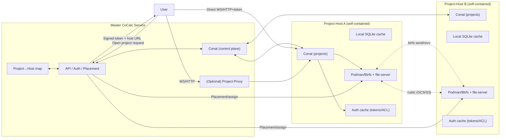

## TODO List

- [x] Build project-proxy service: moves SSH/HTTP forwarding out of file-server.

- [ ] Create a server similar to src/packages/lite that serves multiple projects and users
  - uses the file\-server, project\-runner and project-proxy packages
  - drop reflect\-sync/sidecar/ssh port forwarding/container in packages/file\-server/ssh for local projects; rely on local Btrfs mounts + podman + embedded file\-server
  - this will have an ssh server and use sshpiperd \(as before\) for user ingress and inter-host rsync
  - compute servers will also connect to this \(to provide temporary GPU resources\) via direct ssh \(for reflect\-sync/rsync\) and conat websockets \(edit history\)
  - compute servers are just cocalc\-lite instances \(single project\) pointed at another project with an API key; they sync a subset of files with the project-host
  - is configured to ALSO connect to a remote master
  
- [ ] add project --> host map in master

- [ ] Implement signed connect tokens

- [ ] implement copying files from one project-host to another (when copies aren't local to a single host: get ssh key and address from master, then do rsync).

- [ ] implement moving projects from one project-host to another using btrfs send/recv.

- [ ] implement rustic backup to GCS (or a disk)

- [ ] create way of loading a project in master that embeds it in an iframe.

## Cocalc New Architecture Plan \(federated project\-hosts \+ proxy\)

- **Roles**  
  - Master: central API/auth/placement; holds project→host map; issues signed connect tokens; optional proxy fallback.  
  - Project-host: self-contained runner/file-server stack (podman + Btrfs + conat + tiny sqlite cache); no user creation or global changes; serves multiple projects.  
  - Project-proxy: separate service for SSH/HTTP/WebSocket ingress when direct host access isn’t possible.

- **Control-plane contracts**  
  - Host registration/keepalive to master (ID, region, public URL/tunnel handle, health, capacity).  
  - Placement APIs: assign/move project; master returns signed user tokens + host URL.  
  - Auth cache on host with push/TTL invalidation from master; hosts can serve with cached ACLs for a bounded TTL if master is slow/unreachable.

- **Data-plane routing**  
  - Preferred: user → project-host directly with a signed token (project, user, expiry, host).  
  - Fallback: user → project-proxy → host using the same token validation.  
  - Routing lookup lives in master; host identity via per-host cert/keys. Keep proxy optional but available for restrictive networks.

- **Service extraction/refactors**  
  - Keep [file-server](./src/packages/file-server) embedded in project-host; remove “central file-server” assumptions in [src/packages/server/conat/file-server/index.ts](./src/packages/server/conat/file-server/index.ts).  
  - Extract SSH/HTTP proxy pieces into [src/packages/project-proxy](./src/packages/project-proxy) (move code from [src/packages/file-server/ssh](./src/packages/file-server/ssh) and relevant parts of [src/packages/server/conat/file-server/index.ts](./src/packages/server/conat/file-server/index.ts)).  
  - Add host-local conat instance per host; master uses conat only for control-plane topics.

- **Project moves and storage**  
  - Moves: snapshot + `btrfs send/recv` between hosts; update project→host map; optional delta/cutover; validate and clean source.  
  - Backups: per-host Btrfs snapshots + rustic to object storage; tag snapshots/backups with project IDs for audit/GC.  
  - PD/Btrfs as primary; optional SSD cache layer later.

- **Hidden/on-prem hosts**  
  - Connector abstraction: direct TCP in-cluster; reverse tunnel (SSH/WireGuard/QUIC) for hidden hosts; project-proxy aware of transport.  
  - Host bootstrap includes master URL/credentials; hidden hosts register via reverse channel but otherwise share the same APIs.

- **Security/auth**  
  - Signed user tokens validated on host and proxy; hosts cannot mint users/projects.  
  - Rate limits per project/host; audit logs for token and ACL decisions.

- **Observability and ops**  
  - Metrics: host health, auth cache hit/miss, master latency, project count, disk/headroom, backup freshness, move success.  
  - Alerts: stale project→host map, failed host dial, token validation failures, low headroom.  
  - Runbooks: add host, move project, rotate keys, restore, handle master outage policy.

- **TODOs carried forward**  
  - Fix file-server SSH idle culler to parse real timestamps from podman’s StartedAt.  
  - Tighten project-proxy HTTP handler to enforce a base path/length before slicing project_id.

- **Rollout steps**  
  1) Build project-proxy service and move SSH/HTTP forwarding out of file-server.  
  2) Embed file-server in project-host; add host registration + project→host map in master.  
  3) Implement signed connect tokens and direct user→host path; keep proxy fallback.  
  4) Implement project move workflow (btrfs send/recv) and backup tagging.  
  5) Pilot a small pool in one zone; test offline/TTL behavior, direct vs proxy, moves/backups; add observability.  
  6) Add reverse-tunnel connector for hidden/on-prem hosts without changing routing core.

## Diagram

Mermaid sketch of master + project-host federation:

##
