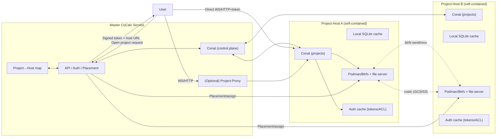

## Checklist (near term)

- [x] Bind project-host HTTP/conat on 0.0.0.0 (temporary); document firewall expectations. Keep a note to revisit Unix-socket bind + container mount for tighter scope.
- [ ] (in progress) Master control-plane: host registration/keepalive, project→host map, placement API; surface placement decisions in UI and hub API.
- [ ] Harden auth: signed connect tokens; enforce project ACLs for start/stop/open; remove anonymous access paths in project-host hub/conat services.
- [ ] Runner networking: keep non-host networking but guarantee containers can reach the host conat endpoint; consider explicit hostfwd mode if we ever bind conat to loopback only.
- [ ] File/quotas/backups UX: default quota + snapshot/backup counts on project create; expose image/pull errors cleanly; add image allowlist (e.g., ubuntu:25.10) and fallback behavior.
- [ ] Cross-host data motion: copy/move between hosts (rsync + btrfs send/recv), GC source after validation, update project→host map, and surface progress/errors to users.
- [ ] Rustic/GCS backup pipeline with retention tags per project/host; per-host health checks.
- [ ] Observability: per-host metrics/logs, minimal status page (runner/file-server/conat), project lifecycle spans; alerts for failed moves/backups and low headroom.
- [ ] Proxy ingress: project-proxy base-path TODO; SSH/HTTP ingress for hidden/on-prem hosts; keep optional but available.
- [ ] Compute/plus alignment: treat compute servers as project-hosts with reflect-sync subset sharing; API for spinning up temporary hosts.

## CoCalc New Architecture Plan (federated project-hosts + proxy)

- **Roles**  
  - Master: central API/auth/placement; holds project→host map; issues signed connect tokens; optional proxy fallback.  
  - Project-host: self-contained runner/file-server stack (podman + Btrfs + conat + tiny sqlite cache); no user creation or global changes; serves multiple projects.  
  - Project-proxy: separate service for SSH/HTTP/WebSocket ingress when direct host access isn’t possible.

- **Control-plane contracts**  
  - Host registration/keepalive to master (ID, region, public URL/tunnel handle, health, capacity).  
  - Placement APIs: assign/move project; master returns signed user tokens + host URL.  
  - Auth cache on host with push/TTL invalidation from master; hosts can serve with cached ACLs for a bounded TTL if master is slow/unreachable.

- **Data-plane routing**  
  - Preferred: user → project-host directly with a signed token (project, user, expiry, host).  
  - Fallback: user → project-proxy → host using the same token validation.  
  - Routing lookup lives in master; host identity via per-host cert/keys. Keep proxy optional but available for restrictive networks.

- **Service extraction/refactors**  
  - Keep [file-server](./packages/file-server) embedded in project-host; remove “central file-server” assumptions in [packages/server/conat/file-server/index.ts](./packages/server/conat/file-server/index.ts).  
  - Extract SSH/HTTP proxy pieces into [packages/project-proxy](./packages/project-proxy) (move code from [packages/file-server/ssh](./packages/file-server/ssh) and relevant parts of [packages/server/conat/file-server/index.ts](./packages/server/conat/file-server/index.ts)).  
  - Add host-local conat instance per host; master uses conat only for control-plane topics.

- **Project moves and storage**  
  - Moves: snapshot + `btrfs send/recv` between hosts; update project→host map; optional delta/cutover; validate and clean source.  
  - Backups: per-host Btrfs snapshots + rustic to object storage; tag snapshots/backups with project IDs for audit/GC.  
  - PD/Btrfs as primary; optional SSD cache layer later.

- **Hidden/on-prem hosts**  
  - Connector abstraction: direct TCP in-cluster; reverse tunnel (SSH/WireGuard/QUIC) for hidden hosts; project-proxy aware of transport.  
  - Host bootstrap includes master URL/credentials; hidden hosts register via reverse channel but otherwise share the same APIs.

- **Security/auth**  
  - Signed user tokens validated on host and proxy; hosts cannot mint users/projects.  
  - Rate limits per project/host; audit logs for token and ACL decisions.

- **Observability and ops**  
  - Metrics: host health, auth cache hit/miss, master latency, project count, disk/headroom, backup freshness, move success.  
  - Alerts: stale project→host map, failed host dial, token validation failures, low headroom.  
  - Runbooks: add host, move project, rotate keys, restore, handle master outage policy.

- **TODOs carried forward**  
  - Fix file-server SSH idle culler to parse real timestamps from podman’s StartedAt.  
  - Tighten project-proxy HTTP handler to enforce a base path/length before slicing project_id.

- **Rollout steps**  
  1) Embed file-server in project-host; add host registration + project→host map in master.  
  2) Implement signed connect tokens and direct user→host path; keep proxy fallback.  
  3) Implement project move workflow (btrfs send/recv) and backup tagging.  
  4) Pilot a small pool in one zone; test offline/TTL behavior, direct vs proxy, moves/backups; add observability.  
  5) Add reverse-tunnel connector for hidden/on-prem hosts without changing routing core.

## Diagram

Mermaid sketch of master + project-host federation:

## Details to not forget

- need to rewrite everything in the frontend involving the project runner directly; in particular, see src/packages/frontend/projects/actions.ts
  - cloning projects
  - moving projects
- need to ensure any backend code that uses projects no longer users runners \(e.g., supporting api\)
- There are api calls/functions for things like "execute code on project" \-\- these will need to send a message to the relevant project\-host and back.
- Project activity \-\- when project is being used, etc. \-\- needs to get updated regularly from the project host to master.

## Completed

- [x] Built project-proxy service and moved SSH/HTTP forwarding out of file-server.
- [x] Created project-host: local conat server + persist, embedded file-server, runner, sqlite + changefeeds, frontend (static + customize + redirect), and hub API wiring for project create/start/stop. Terminals and file browsing now work end-to-end.
- [x] Removed sidecar/reflect-sync path; runner now directly launches single podman container with Btrfs mounts.
- [x] Vendored file-server bootstrap into project-host with Btrfs/rustic/quotas; added fs.* conat service and SSH proxy integration.
- [x] Moved SEA/bundle logic from lite to plus and from runner to project-host; excluded build output from tsc; removed old REST `/projects` endpoints and added catch-all redirect.

