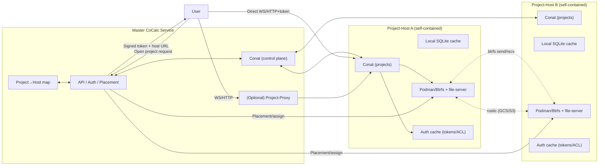

## Checklist for alpha release

- [x] Quota/usage widget missing in the explorer

- [ ] Clone project \-\- doesn't work \(uses old load balancer/project runner model?\)  

- [ ] Image selection has no effect

- [ ] image suggested list \(e.g., ubuntu:25.10\) and fallback behavior.
   - have an advanced checkbox so people can enter any image with appropriate caveats

- [ ] expose image/pull errors cleanly

## Checklist for beta release

- [ ] rewrite stopIdleProjects to use new architecture \(and everything that used the old project runner load balancer code\)

- [ ] Kubernetes support

- [ ] Reflect sync path sharing.
  - [ ] internal to a project\-host; currently uses mutagen, so rewrite to use reflect\-sync
  - [ ] between two project\-hosts
  - [ ] implement a frontend UX for configuring this

- [ ] implement /scratch for projects:
  - [ ] a btrfs subvolume on a configurable btrfs fs; by default same as project, but could be configured to be a different btrfs
  - [ ] no snapshots or backups of any kind
  - [ ] deleted when project is moved
  - [ ] restore backups to /scratch not \$HOME/scratch
    - this requires actually having /scratch as a separate volume, which we don't have right now, evidently

- [ ] Compute servers = dedicated/owned project hosts
  - [ ] treat compute servers as user\-scoped project\-hosts with reflect\-sync subset sharing; 
  - [ ] API for spinning up temporary hosts
  - [ ] drop project\_id column from compute\_servers in favor of host auth/ACL.

- [ ] There are api calls/functions for things like "execute code on project" \-\- these will need to send a message to the relevant project\-host and back.

- [ ] Project activity \-\- when project is being used, etc. \-\- needs to get updated regularly from the project host to master.

- [ ] Security: Right now technically project\-hosts allow users to directly create projects on them, which should not be allowed \(though not via UI\). Even worse, user can specify the project\_id, which is a major security issues. See src/packages/project\-host/hub/projects.ts

- [ ] Security: When setting a project we always add the default cocalc\-lite account so we can keep things working: " // [ ] TODO \-\- for now we always included the default user; this is obviously temporary"  

- [ ] #security: src/packages/server/conat/route\-client.ts currently gives away the master hosts secret auth to any project\-host, which of course isn't good.

- [ ] eliminate payg \(=pay as you go\) entirely for projects
  - easy: just hide a box in the ui...

- [ ] Backups \-\- Rustic/GCS backup pipeline with retention tags per project/host; per\-host health checks.
  - [ ] creating larger backups errors in the frontend due to timeout \(backup is created\).

## Checklist for public release

- [ ] security: use forcecommand for btrfs container

- [ ] Project lifecycle not enforced during moves \-\- the source project isn’t blocked \(including sandboxed file ops\) before the send, so writes could race.

- [ ] finish SEA binary for running project\-host:
  - [ ] include binaries
  - [ ] allow user to select where project is hosted for easier testing \(could be hidden dev feature\)

- [ ] Harden auth: signed connect tokens; enforce project ACLs for start/stop/open; remove anonymous access paths in project\-host hub/conat services.
  - [ ] Issue short\-lived signed tokens \(project\_id \+ perms \+ exp\) from master when opening a project
  - [ ] browser uses them to open `wss://<host>/conat` directly. 
  - [ ] Hosts validate tokens locally.

- [ ] Project host networking: 
  - [ ] keep non\-host networking but guarantee containers can reach the host conat endpoint
  - [ ] consider explicit hostfwd mode if we ever bind conat to loopback only.

- [ ] Observability:
  - [ ] per\-host metrics/logs
  - [ ] minimal status page \(runner/file\-server/conat\)
  - [ ] project lifecycle spans
  - [ ] alerts for failed moves/backups and low headroom.

## Checklist for later

- [ ] Proxy ingress: 
  - [ ] project\-proxy base\-path
  - [ ] SSH/HTTP ingress for hidden/on\-prem hosts

- [ ] \(later\) POSIX File\-server that doesn't require btrfs \(no snapshots or quotas, but has rustic backups\). This would make it possible to support running the entire project\-host purely in userspace \(with podman\) on both Linux and MacOS. Also won't use overlayfs for containers since that also requires root.

- [ ] \(later\) Advanced use of backups:
  - [ ] restore project from a backup to a given project\-host
    - first do restore,
    - then delete project from whatever other host it was on
  - [ ] surface restore as a way to access a project that is on a broken/gone/vanished host. For compute servers, this could be very important: make sure all projects are backed up, then deprovision

## CoCalc New Architecture Plan (federated project-hosts + proxy)

- **Roles**
  - Master: central API/auth/placement; holds project→host map; issues signed connect tokens; optional proxy fallback.
  - Project-host: self-contained runner/file-server stack (podman + Btrfs + conat + tiny sqlite cache); no user creation or global changes; serves multiple projects.
  - Project-proxy: separate service for SSH/HTTP/WebSocket ingress when direct host access isn’t possible.

- **Control-plane contracts**
  - Host registration/keepalive to master (ID, region, public URL/tunnel handle, health, capacity).
  - Placement APIs: assign/move project; master returns signed user tokens + host URL.
  - Auth cache on host with push/TTL invalidation from master; hosts can serve with cached ACLs for a bounded TTL if master is slow/unreachable.

- **Data-plane routing**
  - Preferred: user → project-host directly with a signed token (project, user, expiry, host) over a dedicated conat socket per host (master socket stays separate).
  - Fallback: user → project-proxy → host using the same token validation.
  - Routing lookup lives in master; host identity via per-host cert/keys. Keep proxy optional but available for restrictive networks.

- **Compute servers (recast as project-hosts)**
  - Compute servers become user-owned project-hosts (powerful VMs, often GPU). No `project_id` column; access controlled by host ACL.
  - Users sync/copy data between projects (reflect-sync/btrfs send) instead of remote-mounting a project FS.
  - Must support userspace-only deployments (podman) for HPC/on-prem; registration + auth is the same as any host.

- **Service extraction/refactors**
  - Keep [file-server](./packages/file-server) embedded in project-host; remove “central file-server” assumptions in [packages/server/conat/file-server/index.ts](./packages/server/conat/file-server/index.ts).
  - Extract SSH/HTTP proxy pieces into [packages/project-proxy](./packages/project-proxy) (move code from [packages/file-server/ssh](./packages/file-server/ssh) and relevant parts of [packages/server/conat/file-server/index.ts](./packages/server/conat/file-server/index.ts)).
  - Add host-local conat instance per host; master uses conat only for control-plane topics.

- **Project moves and storage**
  - Moves: snapshot + `btrfs send/recv` between hosts; update project→host map; optional delta/cutover; validate and clean source. Also move all persist sqlite stores!
  - Backups: per-host Btrfs snapshots + rustic to object storage; tag snapshots/backups with project IDs for audit/GC. Also backup all persist sqlite stores.
  - PD/Btrfs as primary; optional SSD cache layer later.

- **Hidden/on-prem hosts**
  - Connector abstraction: direct TCP in-cluster; reverse tunnel (SSH/WireGuard/QUIC) for hidden hosts; project-proxy aware of transport.
  - Host bootstrap includes master URL/credentials; hidden hosts register via reverse channel but otherwise share the same APIs.

- **Security/auth**
  - Signed user tokens validated on host and proxy; hosts cannot mint users/projects.
  - Rate limits per project/host; audit logs for token and ACL decisions.

- **Observability and ops**
  - Metrics: host health, auth cache hit/miss, master latency, project count, disk/headroom, backup freshness, move success.
  - Alerts: stale project→host map, failed host dial, token validation failures, low headroom.
  - Runbooks: add host, move project, rotate keys, restore, handle master outage policy.

- **TODOs carried forward**
  - Tighten project-proxy HTTP handler to enforce a base path/length before slicing project_id.

- **Rollout steps**
  1. (done) Embed file-server in project-host; add host registration + project→host map in master.
  2. Implement signed connect tokens and direct user→host path; keep proxy fallback.
  3. Implement project move workflow (btrfs send/recv) and backup tagging.
  4. Pilot a small pool in one zone; test offline/TTL behavior, direct vs proxy, moves/backups; add observability.
  5. Add reverse-tunnel connector for hidden/on-prem hosts without changing routing core.

## Diagram

Mermaid sketch of master + project-host federation:

## TODO: Misc Things to not forget

- [ ] hygiene: ensure any backend code that uses projects no longer users runners \(e.g., supporting api\)
- [ ] eliminate this: src/packages/conat/project/runner/load\-balancer.ts
- [ ] \(later\) automatically start project on _successful_ ssh attempt.
  - I don't know how to do this, except by possibly having to fork sshpiperd or rewrite that plugin... but that's fine.

## Completed

- [x] Backups \-\- Rustic/GCS backup pipeline with retention tags per project/host; per\-host health checks.

- [x] implement move project using btrfs
  - [x] deleting snapshot fails after a move \(some stale state somewhere on the backend; not sure\)

- move
  - [x] snapshot creation after move broken due to missing qgroup \(?\)
  - [x] **Snapshots not preserved:** we only send a single readonly snapshot created on the fly; existing project snapshots aren’t carried over.
  - [x] large streams: send progress updates instead of one req/resp.
  - [x] the worker seems to be extremely inefficient, doing one step for one project at a time.
  - [x] **No progress/reporting:** the UI gets no status or bytes‑sent updates; failures aren’t surfaced back to the hub.
  - [x] **Cleanup/rollback:** partial moves don’t clean up temp snapshots on source/dest or roll back assignments.
  - [x] sendProject timeout issue
  - [x] issue with creating snapshots after a move being broken:
  - [x] move persist files as well
- backup
  - [x] browse backups efficiently
  - [x] restore from backups
  - [x] add banner in project settings with links to snapshots and backups
  - [x] ensure user can create rustic backup \(frontend ui\)
  - [x] user can restore path from backup
  - [x] enhance backup content to include sync data \(i.e., persist timetravel edit histories, etc.\) for that project.
- [x] rewrite src/packages/project\-proxy/container.ts, in process rewriting /src/packages/project\-proxy/proxy.ts to take a function to get port as input

- [x] make sure the websockets to project\-host properly reconnect, despite different config.
- [x] Cross\-host data motion: copy/move between hosts \(rsync \+ btrfs send/recv\), GC source after validation, update project→host map, and surface progress/errors to users.
  - [x] implement copy between _different_ project\-host via ssh

- [x] looking up the project is async but the subject routing is sync, so it will fail the first time in src/packages/server/conat/route\-project.ts; this MUST get fixed or everything will be broken/flakie at first. Solution is make some options to conat/core/client be a promise optionally and delay the connection.
- [x] memory quota: i think that was set on the pod; I don't see it being set now at all
  - run_quota
- [x] set the container hostname
- [x] Btrfs Snapshots
  - [x] the \$HOME/.snapshots directory does not exist
  - [x] creating snapshots fails with this error: "request \-\- no subscribers matching 'file\-server' \- callHub: subject='hub.account.d0bdabfd\-850e\-4c8d\-8510\-f6f1ecb9a5eb.api', name='projects.createSnapshot', code='503'"

  - [x] ssh to project
    - [x] load ssh keys on project creation \(showing that authorized_keys column works\)
    - [x] write .ssh/.cocalc/sshd/authorized_keys from sshpiperd config
    - [x] get sshpiperd to auth properly and observer manually that ssh works
    - [x] update ssh on project\-host when they change in master and when project starts
  - [x] Jupyter \-\- attempting to start shows this error "Error: syncdb's ipywidgets_state must be defined!"

- [x] Bind project\-host HTTP/conat on 0.0.0.0 \(temporary\); document firewall expectations. Keep a note to revisit Unix\-socket bind \+ container mount for tighter scope.

- [x] Master control\-plane: host registration/keepalive, project→host map, placement API; surface placement decisions in UI and hub API.

- [x] Connect to projects via per\-host websocket \(no iframe\).
  - Use separate conat sockets per host in the frontend; master socket remains for hub/db.
  - Add a master proxy fallback \(`/project-host/<id>/conat` → upstream\) and auto\-failover if direct connect fails; reuse a single socket per host and multiplex multiple projects on it.
- [x] Uploading and downloading images and files over http; used e.g., for the latex editor to look at the pages. This is a feature of the web server, which is fully implemented in packages/hub/ and certainly in packages/lite, and probably is easy to just enable, hopefully. The files are read/written streamed over conat.
- [x] Similar issue \-\- proxying of http to the project doesn't work yet, e.g., so can run jupyterlab, vscode, etc. Need to look up project's host and proxy that way.
- [x] Built project-proxy service and moved SSH/HTTP forwarding out of file-server.
- [x] Created project-host: local conat server + persist, embedded file-server, runner, sqlite + changefeeds, frontend (static + customize + redirect), and hub API wiring for project create/start/stop. Terminals and file browsing now work end-to-end.
- [x] Removed sidecar/reflect-sync path; runner now directly launches single podman container with Btrfs mounts.
- [x] Vendored file-server bootstrap into project-host with Btrfs/rustic/quotas; added fs.\* conat service and SSH proxy integration.
- [x] Moved SEA/bundle logic from lite to plus and from runner to project-host; excluded build output from tsc; removed old REST `/projects` endpoints and added catch-all redirect.

