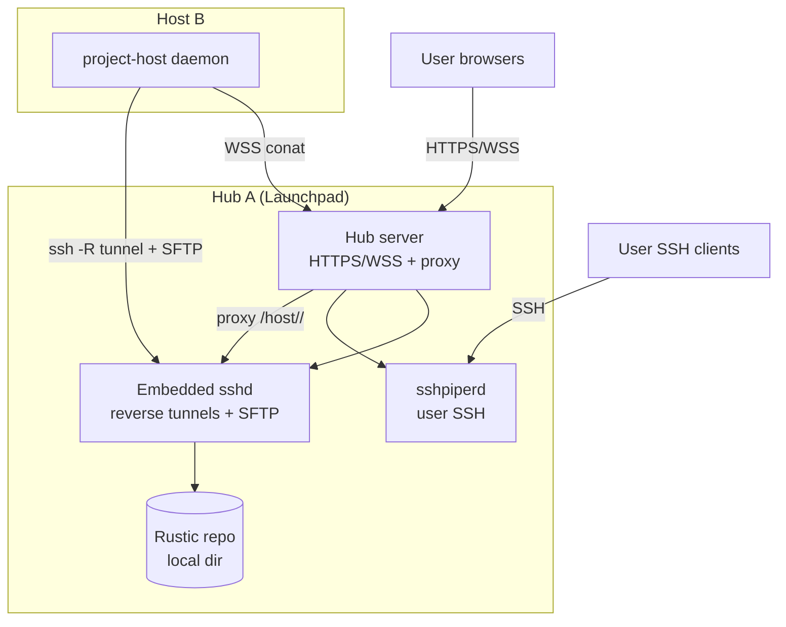

# Support Minimal OnPrem Cloud

## Goal

Provide a purely on‑prem deployment mode for CoCalc Launchpad with max simplicity:

- no Cloudflare tunnels
- no R2 or external buckets
- no root-required services by default
- minimal admin input and minimal moving parts

## Summary Architecture

- Mermaid diagram:

- Single hub runs:
  - Launchpad hub server (HTTPS + WebSocket)
  - sshd (embedded, user-mode, for host reverse tunnels + SFTP)
  - sshpiperd (user-mode, for end-user SSH to projects)
  - http-proxy-3 (or equivalent) for host WebSocket/HTTP proxying
- Project hosts run:
  - project-host daemon
  - reverse SSH tunnel to hub’s embedded sshd
  - outbound WSS to hub for conat
- Backups:
  - rustic uses SFTP to hub sshd
  - single repo for all projects (use host tag per project)
- No wildcard DNS required; use path-based routing:
  - /host/<host_id>/... proxied to a local tunnel port

## Networking Model (Hub A + Host B behind NAT)

- Host B only needs outbound access to Hub A:
  - HTTPS/WSS to hub port
  - SSH to sshd port (reverse tunnel)
- Hub can reach Host B via the reverse tunnel for:
  - WebSocket proxy to project-host services
  - sshpiperd proxy for project SSH access

## Configuration (Admin-Facing)

Provide env vars and admin settings with sane defaults.
Defaults aim for rootless usage; admin may override to use 443/80/22 if desired.
Prefer a single "base port" for minimal admin input, with derived defaults.

Proposed defaults (base port model):

- COCALC_BASE_PORT=8443
- COCALC_HTTPS_PORT=COCALC_BASE_PORT
- COCALC_HTTP_PORT=COCALC_BASE_PORT-1 (optional; can be disabled)
- COCALC_SSHD_PORT=COCALC_BASE_PORT+1 (embedded sshd for reverse tunnel + SFTP)
- COCALC_SSHPIPERD_PORT=COCALC_BASE_PORT+2 (end-user SSH)
- COCALC_DATA_DIR=~/.local/share/cocalc/launchpad

Optional overrides:

- COCALC_BIND_HOST=0.0.0.0
- COCALC_DISABLE_HTTP=true
- COCALC_PROXY_PREFIX=/host
- COCALC_SFTP_USER=cocalc (user name inside sshd)
- COCALC_SFTP_ROOT=${COCALC_DATA_DIR}/backup-repo
- Explicit port overrides (rare): COCALC_HTTPS_PORT, COCALC_HTTP_PORT,
  COCALC_SSHD_PORT, COCALC_SSHPIPERD_PORT

If admin wants standard ports, they can:

- run under privileged port forwarding or
- start with COCALC_HTTPS_PORT=443, COCALC_SSHD_PORT=22, COCALC_SSHPIPERD_PORT=22xx (requires permissions)

## SSH Key & Access Model

Hub generates and manages:

- host tunnel key (for host reverse tunnel)
- sftp key (for rustic SFTP access)
- user SSH keys for sshpiperd (existing behavior)

sshd config highlights (user-mode safe):

- GatewayPorts no (bind reverse ports to localhost only)
- AllowTcpForwarding yes for host tunnel keys
- PermitOpen/permitlisten restrictions per key
- ForceCommand internal-sftp -d <repo> for SFTP keys
- no-pty, no-agent-forwarding, no-X11-forwarding for tunnel/SFTP keys

## Host Tunnel Mapping

Hub assigns a single local port per host to proxy all project-host traffic.
Example:

- Host B connects with ssh -N -R 127.0.0.1:<port>:127.0.0.1:<host_service_port>.
- Hub proxy routes /host/<host_id>/... to localhost:<port>.
  - Optimization: if host and hub are on the same machine, skip SSH tunnel and
    proxy directly to localhost host_service_port.

## Rustic Repo Layout

- Single repo, e.g. sftp://<hub>:<port>/<LP_SFTP_ROOT>
- Use host=project-<project_id> tags (already used)
- No per-project repo needed

## Implementation Plan

### 1) Add On-Prem Mode Config

- Add new Launchpad config block: minimal_onprem or onprem_mode.
- Map env vars to config with defaults (base port derived ports).
- Define and validate ports, data_dir, bind_host, proxy_prefix.

### 2) Embedded sshd + sshpiperd Lifecycle

- Bundle sshd \+ sshpiperd binaries in Launchpad release.
  - we setup [https://github.com/sagemathinc/static\-openssh\-binaries](https://github.com/sagemathinc/static-openssh-binaries)  for sshd static binaries
- On hub startup:
  - create data\_dir/ssh/ for keys \+ configs
  - render sshd\_config for:
    - reverse tunnel keys
    - SFTP keys
  - spawn sshd \+ sshpiperd as child processes
  - supervise \+ restart on crash

### 3) Reverse Tunnel Registration

- Extend hub to allocate reverse_port per host.
- Provide host with assigned port + sshd endpoint.
- Host connects with ssh -N -R 127.0.0.1:<port>:127.0.0.1:<project_host_port>.
- Hub stores mapping host_id -> port for proxy routing.

### 4) Proxy Integration

- Hub uses http-proxy-3 to route:
  - /<prefix>/<host_id>/... to localhost:<reverse_port>.
- Ensure WebSocket upgrade support.
- Avoid URL conflicts by reserving the prefix path.

### 5) Rustic SFTP Integration

- Generate SFTP key and write to project-host config.
- SFTP repo path defaults to data_dir/backup-repo.
- Keep repo single; rely on tags for per-project separation.

### 6) Host Provisioning / Connector

- Connector handshake includes:
  - hub host+port
  - sshd port
  - assigned reverse port
  - SFTP credentials
- Use a single join token: host fetches all connection details from hub
  (minimizes admin input).
- If changing ports is too complex, require explicit config at first bootstrap.

### 7) Health & Diagnostics

- Hub exposes:
  - sshd running
  - sshpiperd running
  - tunnel connectivity per host
  - proxy route test
  - SFTP write check

### 8) Documentation & Defaults

- Document minimal on\-prem mode:
  - single hub \+ hosts local LAN setup
  - required open ports
  - how to override ports
  - where backups are stored
- Design decision \-\- there are two separate modes for CoCalc launchpad and you can ONLY use one \(if you want both, run two separate servers\):
  - cloud: you configure cloudflare, r2, etc.
  - local: what is described here

## Open Questions

- Do we allow dynamic port changes after install, or require restart?
  - ANSWER: let's require restart.  This should be rare, and we need to keep scope manageable.
- Should LP\_HTTP\_PORT be disabled by default?
  - ANSWER: yes and when enabled it should just be a redirect.
- Do we need a simple built\-in UI to view tunnel status?
  - ANSWER: I think the current host drawer / host page can do this.

## TODO (Later)

- Add a dedicated admin guidance UI for selecting modes, validating config, and
  onboarding (defer until core plumbing is complete).
