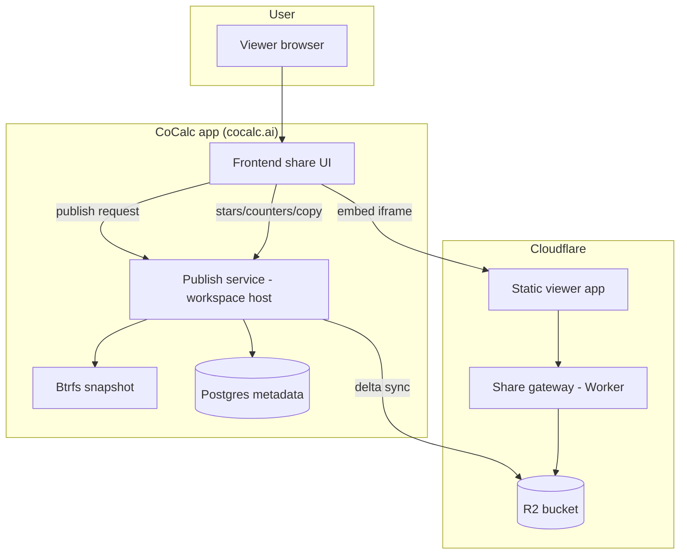

# Share Server Replacement Plan (cocalc.ai)

## Context and constraints

- Current share server is implemented in Next.js: [src/packages/next/components/share](./src/packages/next/components/share) and [src/packages/next/lib/share](./src/packages/next/lib/share).
- Content is copied from project storage to an NFS share; large shares (up to 50GB) make incremental updates painful.
- Rendering shares on the main domain increases XSS risk and forces heavy sanitization that breaks rich content (3D, math).
- Server-side rendering is expensive, DOM emulation is awkward, and SEO value is limited.
- Vhosts and github/gist proxy shares can be dropped.
- Publishing must be explicit. No auto publish on save.
- Copy to workspace must come from the published snapshot, never the live project.

## Goals

- Explicit publish workflow with a snapshot-based source of truth.
- Separate domain for rendering to isolate XSS risk.
- Incremental publish updates (rsync-like) for large shares.
- Lightweight, modern viewer app (no Next.js).
- Share browsing UI, stars, counters, and copy flow live in the main frontend.
- Support public, unlisted, and authenticated/org access.

## Non-goals

- Live shares tied to file saves.
- Vhost-based hosting.
- Rendering github/gist content in the share system.
- Migrating existing cocalc.com shares at launch.

## Proposed architecture

## Data model

- Keep `public_paths` for project settings, but add a new `published_shares` table or extend the schema with:
  - share_id (random, immutable), project_id, path
  - scope (public, unlisted, authenticated, org)
  - published_at, size_bytes, last_publish_status
  - latest_manifest_id, latest_manifest_hash
- Store blobs in a content-addressed layout: `share/{share_id}/blobs/{hash}`.
- Store manifests in `share/{share_id}/manifests/{manifest_id}.json`.
- Store share metadata in `share/{share_id}/meta.json`.
- Update `share/{share_id}/latest.json` atomically to point to the newest manifest.

## Publish workflow (explicit only)

1. User clicks Publish (or Publish Update) in the project share UI.
2. Hub creates a btrfs snapshot and records a publish job.
3. Exporter walks the snapshot, filters hidden files, and builds a manifest:
   - path, size, mtime, content_type, hash (optional for huge files)
4. Compare the manifest to the previously published manifest and upload only missing blobs.
5. Upload the new manifest, then flip `latest.json` after all uploads succeed.
6. Update database metadata and counters, then garbage-collect unreferenced blobs.

## Incremental sync strategy

- Use manifest diffing to avoid re-uploading unchanged data.
- For large files, use size + mtime as a fast path, then hash on mismatch.
- Use multipart uploads for large assets and parallelize where safe.
- Keep only the latest manifest; remove old manifests after a grace period.

## Viewer app (client-only, no SSR)

- Build a dedicated share viewer entrypoint in `packages/static` that reuses existing renderers:
  - Markdown, nbviewer, slides, whiteboard, codemirror, images, audio/video.
- Viewer loads `latest.json` + manifest + metadata, then renders in the browser.
- HTML files render in a sandboxed iframe; PDFs and media stream from R2.
- Add a strict CSP on the viewer domain to contain active content.
- Start minimal (Markdown + images + PDFs + ipynb) and iterate.

## Access control and security

- Public and unlisted shares are static objects in R2.
- Authenticated or org shares require a short-lived JWT minted by cocalc.ai.
- A Cloudflare Worker validates the JWT and serves or denies R2 access.
- Keep all share rendering on a separate domain and embed in the main UI via iframe.

## Main frontend UI

- Browsing, stars, counters, and share metadata live in the main frontend app.
- Viewer content is embedded in an iframe from the share domain.
- Copy to workspace pulls from the published snapshot in R2 with an explicit trust prompt.
- Share listing and search are handled by the main app (not the viewer).

## Migration plan

- Launch as a new site (cocalc.ai) with no legacy shares.
- Consider a per-user migration tool later, with explicit opt-in.

## Operational notes

- R2 lifecycle rules for cleanup and storage limits.
- Publish job queue, retries, and failure visibility in the UI.
- Rate limits on Worker endpoints to reduce abuse.
- Make this efficient for large input.
- Optional pre-rendered previews for social sharing only, if needed.

## Decisions

- Keep only the latest snapshot; no version history in the share system.
- First-release renderers: Jupyter, CodeMirror, Markdown, PDF.
- Search indexing is explicit opt-in.
- Store derived artifacts in the bucket; invalidation strategy to be determined.

## Detailed implementation plan

### 1) Storage spec and manifest format

- Define object layout in R2:
  - `share/{share_id}/latest.json`
  - `share/{share_id}/manifests/{manifest_id}.json`
  - `share/{share_id}/blobs/{hash}`
  - `share/{share_id}/artifacts/{manifest_id}/{path_hash}.png` (optional)
- Manifest shape (versioned):
  - `share_id`, `manifest_id`, `created_at`
  - `root_path`, `scope`, `indexing_opt_in`
  - `files[]`: `path`, `hash`, `size`, `mtime`, `content_type`, `kind`
  - `dirs[]`: optional directory listing to accelerate navigation
- Define hashing policy: sha256 for changed files, size+mtime for unchanged, skip hash for huge files until needed.
- Define allowed paths (no dotfiles, no `..`, no symlinks outside root).

### 2) Database + API surface

- Add a `published_shares` table \(or extend current share metadata\):
  - `share_id`, `project_id`, `path`, `scope`, `indexing_opt_in`
  - `latest_manifest_id`, `latest_manifest_hash`, `published_at`
  - `size_bytes`, `last_publish_status`, `last_publish_error`
- API endpoints \(owned by the main app, not the viewer\):
  - `POST /api/v2/shares/create` \(create share_id and settings\)
  - `POST /api/v2/shares/publish` \(enqueue publish job\)
  - `GET /api/v2/shares/status` \(progress \+ last error\)
  - `POST /api/v2/shares/indexing` \(toggle opt\-in\)
  - `POST /api/v2/shares/viewer-token` \(JWT for gated shares\)
  - `POST /api/v2/shares/copy` \(copy from published snapshot\)
  - `POST /api/v2/shares/stars` and `POST /api/v2/shares/counter` \(reuse existing star/counter logic\)
  - NOTE: add these to the hub conat websocket api at src/packages/conat/hub/api instead \-\- that gives full typescript checking front and back, minimal latency, etc. and it's easy to bridge to our http api if needed.
    - you define the typings in src/packages/conat/hub/api and the implementation in src/packages/server/conat/api
    - the actual data transfer of files will happen from a "workspace host" \- see src/packages/project\-host; and there is a mechanism to send messages to hosts used in src/packages/server/cloud and src/packages/server/conat, I think.

### 3) Publish pipeline (snapshot -> manifest -> blobs -> latest)

- Create a publish job runner in the hub or a dedicated service.
- Steps:
  1. Create btrfs snapshot for a consistent read view.
  2. Walk snapshot, build manifest records, compute hashes for changed files only.
  3. Compare to previous manifest, upload only missing blobs to R2.
  4. Upload manifest JSON.
  5. Atomically update `latest.json` (single put).
  6. Update DB status and metrics.
  7. Garbage-collect unreferenced blobs after a grace period.
- Support streaming uploads and multipart for large files.
- Emit progress events for UI.
- Failure handling: idempotent reruns, partial upload cleanup, and clear error messages.

NOTE: be sure to check out everything related to the long_running_operations postgresql table and LRO worker and docs/long\-running\-operations.md, since that is useful for providing insight to the user and clear state machine for doing tasks like the above. this requires coordination with the project\-host that has the content.

Also note "project = workspace" in cocalc.

### 4) Viewer app bundle

- Add a dedicated viewer entrypoint in [src/packages/static](./src/packages/static).
- Loader:
  - Fetch `latest.json`, then manifest, then resolve the requested path.
  - Render by `kind` with first\-release renderers: Jupyter, CodeMirror, Markdown, PDF.
  - Provide a fallback download link for unknown types.
  - NOTE: the code in src/packages/next/components/share should be helpful in seeing what to bundle in this entry point
- Routing:
  - Share path routes map to manifest entries; directory routes use manifest `dirs[]`.
  - Relative links inside Markdown/Jupyter are rewritten using manifest lookups.
- Security:
  - Strict CSP on the viewer domain.
  - HTML rendered only in sandboxed iframes.

### 5) Cloudflare Worker + R2 delivery

- Public/unlisted:
  - Direct object access with long-lived caching for blobs.
  - `latest.json` and manifest short-lived caching.
- Auth/org:
  - Worker validates JWT; denies without token.
  - Range requests for PDFs and media.
  - Rate limits and structured error responses.

### 6) Frontend integration

- Share UI lives in the main frontend app:
  - Publish button + progress indicator.
  - Indexing opt-in toggle with a warning about search visibility.
  - Embed viewer in an iframe on the share detail page.
  - Copy-to-workspace flow pulls from manifest + blobs in R2.
- Update share configuration UI in [src/packages/frontend/share](./src/packages/frontend/share) and related project pages.

### 7) Operations and monitoring

- Metrics: publish time, bytes uploaded, failure rate, viewer load errors.
- Alerting on publish failures and worker errors.
- R2 lifecycle rules for old manifests and unused blobs.
- Optional admin tools for GC and re-publish.

## Artifact invalidation options

- Versioned artifact keys per manifest (e.g., previews/{manifest_id}/{path_hash}.png); delete artifacts when old manifests are retired.
- Stable artifact keys with cache-busting query params tied to the manifest hash; relies on CDN cache TTLs.
- On-demand generation with TTL and background GC for artifacts not referenced by the latest manifest.

## Phased rollout

1. Publish pipeline and R2 storage with manifest + metadata.
2. Viewer app v1 for core file types.
3. Frontend share UI with stars, counters, and copy flow.
4. JWT-gated access for authenticated/org shares.
5. Optional enhancements: versions, previews, richer search.

## Current implementation status (share-server-plan branch)

### Completed and usable for end-to-end testing

- Published shares schema (`published_shares`) and share metadata API.
- LRO-backed publish flow that snapshots, diffs manifests, uploads content-addressed blobs, writes `latest.json` + `meta.json`, and records publish status.
- Regional R2 bucket selection and storage layout under `share/{share_id}/...`.
- Cloudflare Worker routing + JWT gating for authenticated/org shares.
- Static share viewer app (client-only) with directory browsing and initial renderers (notebooks, markdown, code, PDFs).
- Frontend share UI: create share, publish, progress, preview iframe, and viewer token generation.
- Worker provisioning with admin settings, plus optional auto-sync of share static assets for dev/test.

### Implemented but optional / dev-oriented

- Local auto-sync of static assets into the share static bucket during worker provisioning (can be disabled in production).
- Versioned static-asset publish script for pushing viewer assets into the software R2 bucket.

### Remaining / Phase 2 work

- Copy-to-workspace flow from published snapshot, with explicit trust prompt.
- Stars/counters and broader share browsing UI in the main app.
- Indexing opt-in pipeline and any search integration.
- Derived artifacts (thumbnails/previews) + invalidation/GC strategy.
- Garbage collection of unreferenced blobs/manifests beyond the latest snapshot.
- Performance work for large shares (timeouts, parallelism, streaming optimizations).
- Production static-asset version switching for the main app (cocalc.ai) if desired.
