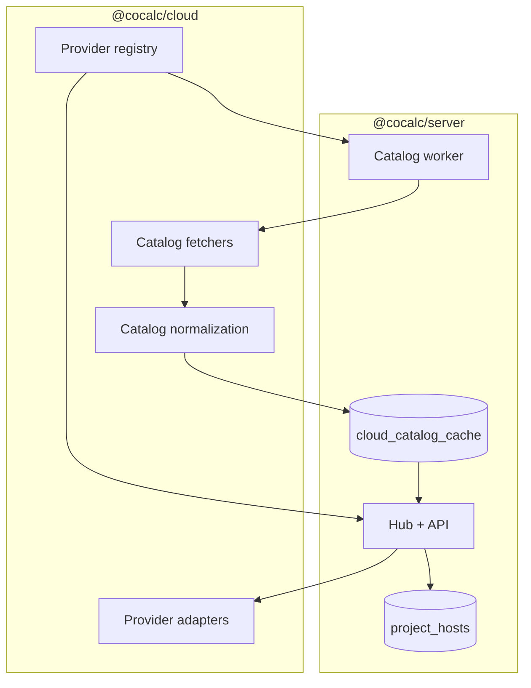

# @cocalc/cloud

This package provides a small, provider\-agnostic interface for provisioning and
controlling project\-host VMs in public clouds. It is intentionally narrow in
scope: create, start, stop, delete, resize, and query status for a VM that will
run a CoCalc project\-host. Everything else \(host registration, auth, billing,
UI, catalog persistence, etc.\) lives in higher\-level packages.

## Purpose

The goal is to make cloud providers swappable. The interfaces here are minimal
and designed to be used by `@cocalc/server` when a user creates or starts a host.
Providers map a generic host spec \(CPU/RAM/disk/GPU/region\) to their own VM
offerings.

## What is here now

- A provider\-agnostic interface (`CloudProvider`, `HostSpec`, `HostRuntime`).
- Provider adapters for GCP, Hyperstack, Lambda, and Local.
- Catalog fetchers per provider \(regions/zones/flavors/images, etc.\).
- Catalog normalization helpers and a provider registry that describes
  capabilities and catalog TTLs.
- A Local provider that keeps an in\-memory lifecycle state for dev/tests.
- Unit tests for provider behavior and catalog normalization.

## Planned additions

- Additional providers \(Nebius, AWS, etc.\) using the same interface.
- Stronger status reconciliation and cost/usage reporting.
- Optional "bootstrap helpers" to generate startup scripts that install
  podman, btrfs, and the project\-host bundle.

## Scope and design constraints

- **No custom image management**: use vendor\-provided base images and bootstrap
  at first boot (cloud\-init / startup scripts).
- **No bucket or storage management**: object storage configuration and mounts
  are handled elsewhere (project\-host or user configuration).
- **No long\-lived orchestration**: once a VM is created, ongoing host logic is
  handled by the project\-host runtime itself.
- **Provider\-specific complexity stays in adapters**: the rest of CoCalc should
  only depend on the interface in `types.ts`.
- **No DB access here**: catalog persistence and locking live in
  `@cocalc/server`; `@cocalc/cloud` only produces catalog data.

## How to add a new cloud

1. Implement a provider in `src/packages/cloud/<provider>/provider.ts` that
   satisfies `CloudProvider` (`createHost`, `startHost`, `stopHost`, `deleteHost`,
   `getHost`, etc.\).
2. Add catalog fetcher(s) in `src/packages/cloud/catalog/<provider>.ts` and a
   `toEntries()` helper that converts provider\-specific data into the generic
   `CatalogEntry` list.
3. Register the provider in `src/packages/cloud/registry.ts` with:
   - `id`, `provider` instance, `capabilities`
   - `fetchCatalog` and `catalog` spec (`ttlSeconds`, `toEntries`)
4. Export the provider and catalog helpers in `src/packages/cloud/index.ts`.
5. In `@cocalc/server`, add fetch options in
   `src/packages/server/cloud/catalog.ts#getCatalogFetchOptions` \(API keys,
   prefixes, credentials\).
6. Add provider settings to `site-settings-extras` if needed.
7. Update the host UI to expose provider selection and catalog fields.

## Architecture

The server supplies credentials, handles locking and persistence, and exposes
catalog data to the frontend. The cloud package owns provider logic and catalog
generation only.

