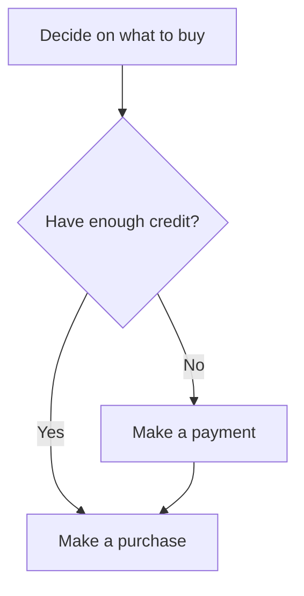

# Purchases

General notes about wording and design.

## Definitions

- Payment = money paid via a credit card or other payment method to cocalc.

- Purchase = made internally in cocalc using credit

