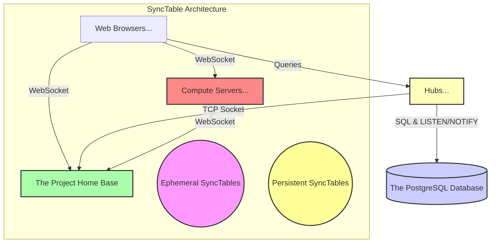
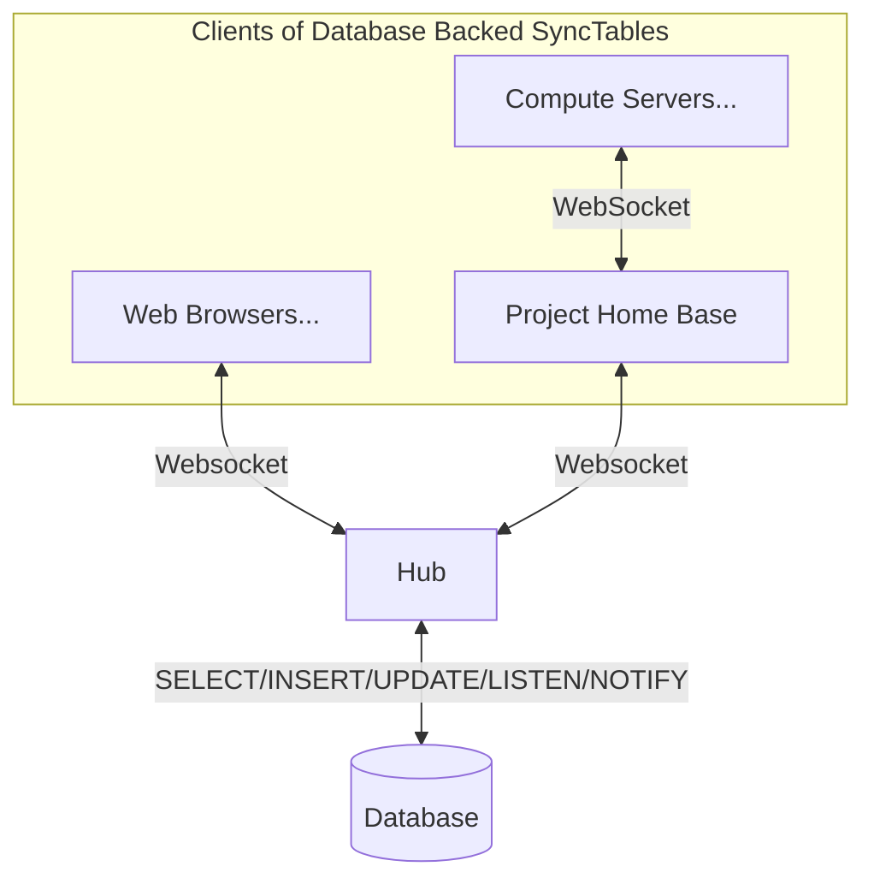
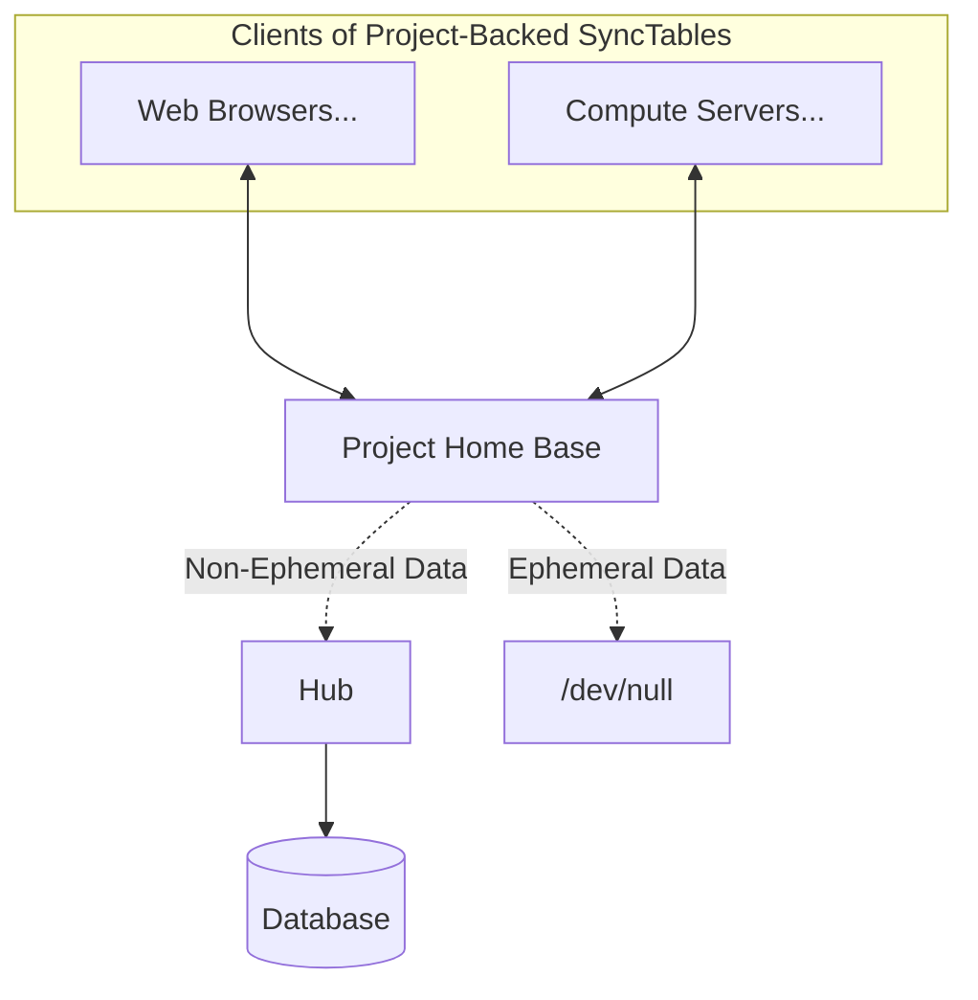
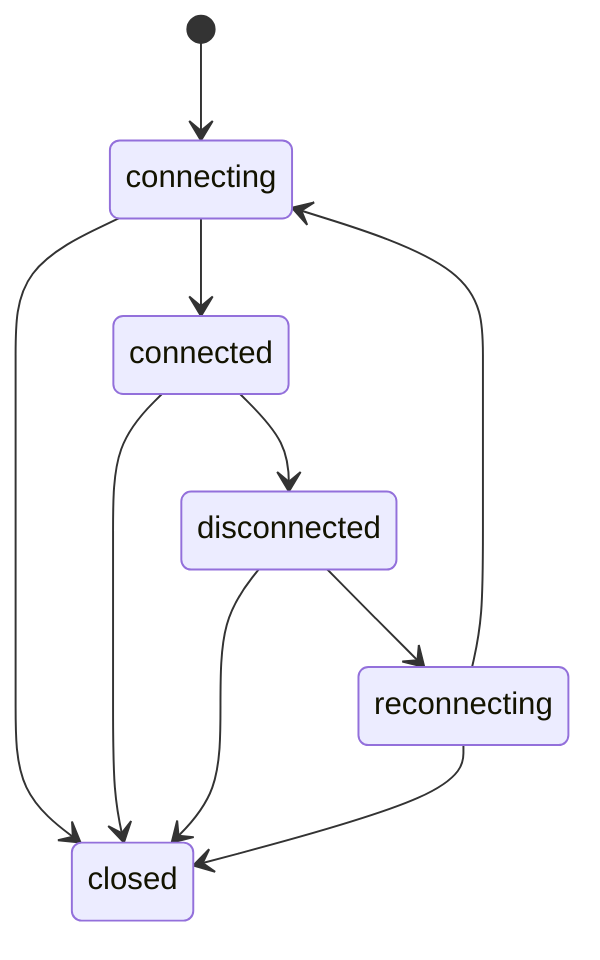

# Synchronized Tables aka SyncTables

A synchronized table is basically a small in\-memory key:value store that is replicated across many web browsers and a cocalc project, and usually persisted in the database. The keys are strings and the values are JSON-able objects. Some of our synctables are defined by a PostgreSQL table and rules that grant a user permission to read or write to a defined subset of the table. There are also ephemeral synctables, which are not persisted to the database, e.g., the location of user cursors in a document.

A web browser can directly manage a synctable via queries \(through a hub\) to the database, e.g., the account settings and list of user projects are dealt with this way.

For file editing, the synctable is managed by the project, and all web browsers connect via a websocket to the project. The project ensures that the syntable state is eventually identical for all browsers to its own state, and is also responsible for persisting data longterm to the database. It does NOT setup a changefeed for file editing with the database, since all file editing goes through the project, hence it is the only one that changes the database table of file editing state.

The direction of the arrow indicates which side _initiates_ the connection; in most cases data flows in both directions,
possibly with a realtime push model (due to persistent connections).

## SyncTables: Motivation and Broader Context

Realtime synchronized text editing and editing complicated data structures like those in Jupyter notebooks is **not** done directly using synctables! Instead, synctables are a low level primitive on which we build those more complicated synchronized documents.

### Global State

We do use synctables to manage various aspects of user state that directly reflects the contents of the database, including:

- all (or recent!) projects a user is a collaborator on,
- the log of activity in an open project,
- account settings for a user,
- files that were recently active in some project you collaborate on

These are all managed via a direct connection between the web browser and a backend hub, which connects to the database and uses PostgreSQL LISTEN/NOTIFY to get realtime updates whenever the database changes. It is not necessary to that if one web browser makes a change, e.g., to account settings, that everybody else sees that as quickly as possible; also, the volume of such traffic is relatively low.

### File Editing State

In contrast, when actively editing a file, the higher level SyncDoc data structures create a synctables that is being populated with new patches every second or two, and these must be made visible to
all other clients as quickly as possible. Moreover, when evaluating code in a Jupyter notebook, a synctable changes to reflect that you want to evaluate code, and is then updated again with a new patch with the result of that code evaluation -- this must all happen quickly, and can't involve the database as part of the data flow. Instead, the browsers and home base communicate directly via a websocket, and the patches are persisted to the database (in big chunks) in the background.

## Protocol Used to Synchronize SyncTables

Synctables exist in three places:

- Web Browsers
- The Project Home Base
- Compute Servers

They are _eventually consistent_, in the sense that if everybody stops making changes and all network connections are working, then eventually all copies of the same table \(i.e., defined by the same query\) will be the same.

There is no fundamental reason regarding the algorithm for not syncing between browsers directly. What is the algorithm though?

### Database Backed Synctables

For synctables that directly reflect the PostgreSQL database, the client writes changes to the hub until they succeed, and the hub listens using LISTEN/NOTIFY for changes to the relevant table in the database, and if they are relevant to the user, sends an update message. Doing this efficiently in general is probably impossible, but we have a pretty explicit list of queries and tables, and special data structures to make this efficient.

The browser client writes changes to the hub until success.

### Project Backed Synctable Protocol

As mentioned above, there is one master \(the home base\) and a bunch of clients. We do not currently do any browser\-to\-browser synchronization of synctables, so when collaboratively editing documents, all data goes from the browser back to the project home base, and is then broadcast back to the other browsers.

Consider a synctable $T_p$ in the project home base $p$ and the corresponding
synctable $T_c$ in a web browser or compute server client $c$. These are key\-value stores, and either synctable may be modified at any time. There is a persistent websocket connection between the project and browser, but we assume it can go down at any time,
but eventually comes back. Assume that all relevant data is stored in memory in
both the project and web browser, since longterm persistent is not relevant to this protocol.

Our goal is to periodically do a sync operation involving $T_p$ and $T_c$, which doesn't require blocking writes on either side, but after which the state of both will be the same if there are no changes to either side.  Moreover, when there are conflicts, we want "last change wins", where time is defined as follows.  We assume that $p$ and $c$ have synchronized their clocks within a second or so, which is fine, given our requirements \(ping times should be far less than 1 second\), and easy to do via a ping.   If between sync operations the same key has different values set, then we resolve the conflict by selecting the one that was changed most recently, with any tie being broken by the project winning.

**NOTE:** This is not a distributed computing paper, it's a simple real life protocol.  Time exists.

First we assume that the network connection is robust and explain how the protocol works.  Then we explain what we do to fix things when the network connection goes down and the client reconnects.  

#### Robust Network

Assume that the network is working perfectly.   Each client keeps track of the following:

- **value:**  the key:value mapping \(we use immutable.js to implement this\)
- **changes:** a map from each key to 

#### Network Connection Breaks

Next we consider the various situation where the network connection breaks.  During that downtime, we must assume that both every table may be getting changed, so of course we can't just reset everything. 

## Defined by an object query

- Do a query against a PostgreSQL table using our object query description.

- Synchronization with the backend database is done automatically.

## Methods

- **constructor\(query\):** query = the name of a table \(or a more complicated object\)

- **set\(map\):** Set the given keys of map to their values; one key must be
  the primary key for the table. NOTE: Computed primary keys will get automatically filled in; these are keys in `packages/util/db-schema`
  where the set query looks like this:
  `(obj, db) -> db.sha1(obj.project_id, obj.path)`

- **get\(\):** Current value of the query, as an immutable.js Map from
  the primary key to the records, which are also immutable.js Maps.

- **get\(key\):** The record with given key, as an immutable Map.

- **get\(keys\):** Immutable Map from given keys to the corresponding records.

- **get\_one\(\):** Returns one record as an immutable Map \(useful if there
  is only one record\)

- **close\(\):** Frees up resources, stops syncing, don't use object further

- **save\(\):** Sync all changes to the database or project home base

## Events

- 'before-change': fired right before (and in the same event loop) actually
  applying remote incoming changes

- 'change', [array of string primary keys] : fired any time the value of the query result
  changes, _including_ if changed by calling set on this object.
  Also, called with empty list on first connection if there happens
  to be nothing in this table. If the primary key is not a string it is
  converted to a JSON string.
- 'disconnected': fired when table is disconnected from the server for some reason
- 'connected': fired when table has successfully connected and finished initializing
  and is ready to use
- 'saved', [array of saved objects]: fired after confirmed successful save of objects to backend

## States

A SyncTable is a finite state machine as follows:

There is a final state called 'closed', that the SyncTable moves to when
it will not be used further; this frees up all connections and used memory.
The table can't be used after it is closed. The only way to get to the
closed state is to explicitly call close() on the table; otherwise, the
table will keep attempting to connect and work, until it works.

- connecting -- connecting to the backend, and have never connected before.

- connected -- successfully connected to the backend, initialized, and receiving updates.

- disconnected -- table was successfully initialized, but the network connection
  died. Can still takes writes, but they will never try to save to
  the backend. Waiting to reconnect when user connects back to the backend.

- reconnecting -- client just reconnected to the backend, so this table is now trying
  to get the full current state of the table and initialize a changefeed.

- closed -- table is closed, and memory/connections used by the table is freed.

## Worry

What if the user does a set and connecting (or reconnecting)
takes a long time, e.g., suspend a laptop, then resume?
The changes may get saved... a month later. For some things,
e.g., logs, this could be fine. However, on reconnect, the first
thing is that complete upstream state of table is set on
server version of table, so reconnecting user only sends
its changes if upstream hasn't changed anything in
that same record.

## Representation

We represent synchronized tables by an immutable.js mapping from the primary
key to the object. Since PostgresQL primary keys can be compound (more than
just strings), e.g., they can be arrays, so we convert complicated keys to their
JSON representation. A binary object doesn't make sense here in pure javascript,
but these do:

      string, number, time, boolean, or array

Everything automatically converts fine to a string except array, which is the
main thing this function deals with below.

### Notes

1. RIGHT NOW: This should be safe to change at
   any time, since the keys aren't stored longterm.
   If we do something with localStorage, this will no longer be safe
   without a version number.

2. Of course you could use both a string and an array as primary keys
   in the same table. You could evily make the string equal the json of an array,
   and this _would_ break things. We are thus assuming that such mixing
   doesn't happen. An alternative would be to just _always_ use a _stable_ version of stringify.

3. We use a stable version, since otherwise things will randomly break if the
   key is an object.

